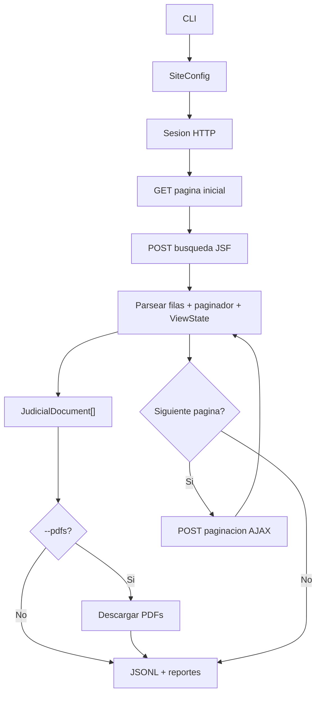

# pj-peru-scraper

Scraper HTTP en TypeScript para portales JSF peruanos. Usa axios + Cheerio, no automatiza navegador. Soporta OEFA (PrimeFaces) y PJ Peru (RichFaces), con extraccion de metadata, paginacion JSF, checkpoints y descarga opcional de PDFs.

## Quick Start

```bash
npm install
npm run build
npm test
```

Prueba local sin depender de portales reales:

```bash
npm run verify:local
```

Smoke test OEFA con 100 documentos y PDFs:

```bash
npm run scrape:oefa:test100
```

PJ Peru requiere VPN o proxy peruano:

```bash
node dist/cli.js --site pj-peru --dry-run --limit 20
```

## Pruebas Importantes

Estas son las pruebas que importan para confirmar que el proyecto corre bien inicialmente.

| Comando | Que valida |
| --- | --- |
| `npm run typecheck` | TypeScript sin errores |
| `npm test` | Suite unitaria: parsers, retry, PDF downloader y mapper |
| `npm run build` | Compilacion a `dist/` |
| `npm run verify:local` | Build + simulacion local de 429/backoff |
| `npm run scrape:oefa:test100` | Extraccion real acotada en red publica |
| `node dist/cli.js --site pj-peru --dry-run --limit 20` | Sesion, busqueda y paginacion PJ Peru con VPN |

La validacion completa de desarrollo es:

```bash
npm run ci
```

## Scripts Principales

| Script | Uso |
| --- | --- |
| `npm run build` | Compila TypeScript |
| `npm run typecheck` | Revisa tipos sin emitir archivos |
| `npm test` | Corre la suite unitaria |
| `npm run ci` | Typecheck + build + lint + tests |
| `npm run simulate:429` | Simula retry/backoff 429 localmente |
| `npm run scrape:oefa:test100` | 100 documentos OEFA + PDFs |
| `npm run scrape:oefa:parallel` | Sectores OEFA en paralelo |
| `npm run scrape:pjperu:districts:dry` | Smoke PJ Peru Superior por distritos, sin escribir datos |
| `npm run scrape:pjperu:districts:test` | Prueba acotada Superior con PDFs |
| `npm run scrape:pjperu:districts` | Extraccion Superior por distritos |
| `npm run scrape:pjperu:suprema:years:dry` | Smoke Suprema por anios, sin escribir datos |
| `npm run scrape:pjperu:suprema:years:test` | Prueba acotada Suprema por anios |
| `npm run scrape:pjperu:suprema:years` | Extraccion Suprema particionada por anio |

## Opciones Del CLI

| Opcion | Uso |
| --- | --- |
| `--site oefa` | Portal OEFA, no requiere VPN |
| `--site pj-peru` | Portal PJ Peru, requiere IP peruana |
| `--sector 1` | OEFA: sector; PJ Peru: `1=SUPREMA`, `2=SUPERIOR` |
| `--district 18` | PJ Peru Superior: distrito judicial |
| `--limit 100` | Limita documentos para pruebas acotadas |
| `--pdfs` | Activa descarga de PDFs |
| `--pdf-dir <dir>` | Directorio de PDFs |
| `--pdf-concurrency 10` | Descargas PDF concurrentes por pagina |
| `--out <path>` | Ruta JSONL de salida |
| `--dry-run` | Recorre sin escribir salida |
| `--resume` | Retoma desde checkpoint |
| `--proxy <url>` | Proxy HTTP/HTTPS |

## Artefactos De Ejecucion

Cada ejecucion no `dry-run` escribe evidencia junto al JSONL.

| Archivo | Proposito |
| --- | --- |
| `*.jsonl` | Un documento por linea |
| `pdfs/*.pdf` | PDFs descargados |
| `run-summary.json` | Totales y metricas principales |
| `page-events.jsonl` | Eventos por pagina |
| `run-report.md` | Resumen humano de la corrida |
| `failed-pdfs.json` | PDFs confidenciales, missing o fallidos |
| `checkpoint_*.json` | Estado para `--resume` |

## Flujo General



## PDFs

PJ Peru expone PDFs por URL directa. OEFA usa acciones JSF con `ViewState`; algunos documentos son confidenciales y no exponen PDF. Esos casos se registran como `confidential`, no como error del scraper.

| Estado | Significado |
| --- | --- |
| `downloaded` | PDF descargado |
| `skippedExisting` | PDF ya existia en disco |
| `confidential` | Documento valido sin PDF publico |
| `missingJsfAction` | No se encontro accion JSF para descargar |
| `missingPdfUrl` | Documento sin URL directa |
| `failedDownload` | Hubo intento real y fallo |

## Retry Y Rate Limit

`withRetry()` se usa en navegacion, paginacion y PDFs. Hace 3 intentos con jitter y registra metricas de retry/429. La prueba local es:

```bash
npm run simulate:429
```

Esto valida dos escenarios: 429 recuperable y 429 persistente. No depende de que el portal real emita 429 durante una corrida.

## Paralelizacion

OEFA se paraleliza por sector:

```bash
npm run scrape:oefa:parallel
```

PJ Peru Superior se paraleliza por distrito judicial:

```bash
npm run scrape:pjperu:districts:dry
npm run scrape:pjperu:districts:test
npm run scrape:pjperu:districts
```

PJ Peru Suprema no tiene distrito, asi que se parte por rango de fechas/anio:

```bash
npm run scrape:pjperu:suprema:years:dry
npm run scrape:pjperu:suprema:years:test
npm run scrape:pjperu:suprema:years
```

La idea es simple: cada worker consulta una particion distinta y escribe su propia salida; al final los runners fusionan resultados cuando corresponde.

## Mapa de Lectura del Codigo

Lee en este orden. Cada capa depende de la anterior.

### Capa 1 - Contratos

| Archivo | Que define |
| --- | --- |
| `src/types.ts` | `JudicialDocument`, `SiteConfig`, `ScrapeOptions` |
| `src/models/internalTypes.ts` | `Session`, `ParsedPage`, `ParsedRow`, `$Root` |
| `src/models/metrics.ts` | `RunMetrics`, `PdfFailure`, `PageEvent`, `PdfDownloadResult` |
| `src/models/scraperTypes.ts` | `SectorResult`, `SectorContext`, `PageMetrics`, `AdvancePageCtx` |
| `src/models/pdfTypes.ts` | `PagePdfStats`, `PdfBatchInput`, `PdfCandidate`, `PdfDownloadConfig` |
| `src/models/jsfTypes.ts` | `PaginationRequest` y tipos JSF |

### Capa 2 - Sesion HTTP

| Archivo | Que hace |
| --- | --- |
| `src/session/cookies.ts` | Jar manual de cookies |
| `src/session/rateLimit.ts` | Detecta rate-limit por contenido o 429 |
| `src/session/retry.ts` | Retry con jitter |
| `src/session/session.ts` | Cliente axios, headers, sockets y start page |

### Capa 3 - Protocolo JSF

| Archivo | Que hace |
| --- | --- |
| `src/jsf/viewState.ts` | Extrae `javax.faces.ViewState` |
| `src/jsf/partialResponse.ts` | Parsea respuestas AJAX JSF |
| `src/jsf/searchForm.ts` | Envia formulario de busqueda |
| `src/jsf/pagination.ts` | Avanza paginas por AJAX |

### Capa 4 - Parsers HTML

| Archivo | Que hace |
| --- | --- |
| `src/parser/paginatorParser.ts` | Lee pagina actual, total y registros |
| `src/parser/rowParser.ts` | Extrae filas PrimeFaces o RichFaces |
| `src/parser/documentMapper.ts` | Convierte filas a `JudicialDocument` |
| `src/parser/pageParser.ts` | Construye un `ParsedPage` completo |

### Capa 5 - PDF

| Archivo | Que hace |
| --- | --- |
| `src/pdf/downloader.ts` | Descarga PDF directo o via accion JSF |
| `src/scraper/pdfBatch.ts` | Clasifica candidatos y descarga en batches |

### Capa 6 - Scraping

| Archivo | Que hace |
| --- | --- |
| `src/scraper/sectorScraper.ts` | Bootstrap, busqueda, paginacion, PDFs y checkpoint |
| `src/scraper/scraper.ts` | Orquesta sectores dentro de un proceso |
| `src/scraper/sectorDiscovery.ts` | Descubre sectores disponibles |

### Capa 7 - Entrada, Configuracion y Runners

| Archivo | Que hace |
| --- | --- |
| `src/config.ts` | Configuracion por sitio: URLs, selectores, columnas y tiempos |
| `src/config/constants.ts` | Todas las constantes numericas y strings del sistema |
| `src/cli.ts` | Flags CLI y arranque |
| `scripts/parallel-sectors.mjs` | Runner paralelo por sector |
| `scripts/parallel-districts.mjs` | Runner paralelo por distrito |
| `scripts/parallel-suprema-years.mjs` | Runner paralelo por anio |

## Licencia

MIT.
