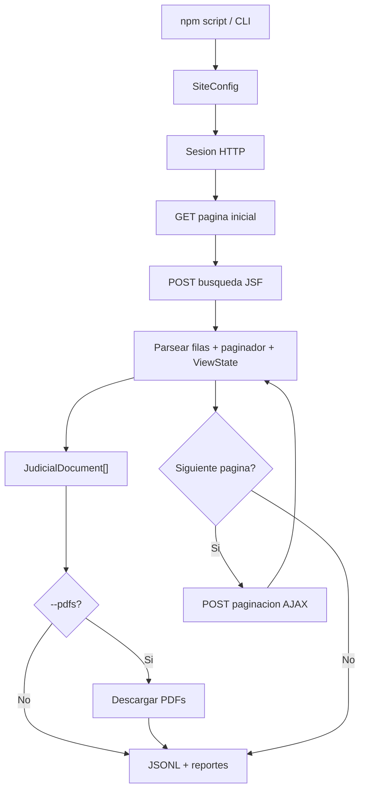

# pj-peru-scraper

Scraper HTTP en TypeScript para portales JSF peruanos. Usa axios + Cheerio, no automatiza navegador. Soporta OEFA (PrimeFaces) y PJ Peru (RichFaces), con paginacion JSF, checkpoints, salida JSONL y descarga opcional de PDFs.

Este README es la primera lectura. El detalle operativo para reviewers esta en [`docs/reviewer-runbook.md`](docs/reviewer-runbook.md).

## Contexto Rapido

El proyecto busca probar que el scraper corre de punta a punta:

- compila y pasa tests unitarios;
- maneja sesiones JSF reales sin browser automation;
- extrae paginas y documentos reales;
- descarga PDFs cuando el portal los expone;
- registra fallos recuperables sin truncar silenciosamente;
- corre en paralelo mediante comandos npm.

Evidencia actual: en una corrida real de Suprema por anio con VPN peruana, el scraper sostuvo cerca de una hora de extraccion, llego a ~43,750 documentos combinando run principal + retry, y demostro que los soft-blocks son contencion del pool JSF, no HTTP 429. Ver [`docs/reviewer-runbook.md`](docs/reviewer-runbook.md).

## Quick Start

```bash
npm install
npm run build
npm test
```

Prueba local sin portales reales:

```bash
npm run verify:local
```

Smoke test OEFA, sin VPN:

```bash
npm run scrape:oefa:test100
```

Smoke test PJ Peru, con VPN o proxy peruano:

```bash
npm run scrape:pjperu:smoke
```

## Ubuntu / Windows

Usar los comandos `npm run ...` como interfaz publica. Los scripts `.mjs` existen como implementacion interna, pero los wrappers npm evitan diferencias de shell entre Ubuntu, Windows y CI.

En Ubuntu:

```bash
npm ci
npm run ci
npm run verify:local
```

Para PJ Peru, primero confirmar VPN peruana:

```bash
curl -s https://jurisprudencia.pj.gob.pe/jurisprudenciaweb/faces/page/inicio.xhtml -o /dev/null -w "%{http_code}\n"
```

Debe devolver `200` antes de correr comandos PJ Peru.

## Pruebas Importantes

| Comando | Que valida |
| --- | --- |
| `npm run typecheck` | TypeScript sin errores |
| `npm test` | 53 tests unitarios |
| `npm run build` | Compilacion a `dist/` |
| `npm run ci` | Typecheck + build + lint + tests |
| `npm run verify:local` | Build + simulacion local de 429/backoff |
| `npm run scrape:oefa:test100` | Extraccion real acotada en red publica |
| `npm run scrape:pjperu:smoke` | Sesion, busqueda y paginacion PJ Peru con VPN |

## Scripts Principales

| Script | Uso |
| --- | --- |
| `npm run simulate:429` | Simula retry/backoff 429 localmente |
| `npm run scrape:oefa:test100` | 100 documentos OEFA + PDFs |
| `npm run scrape:oefa:parallel` | Sectores OEFA en paralelo |
| `npm run scrape:pjperu:smoke` | Smoke PJ Peru directo por CLI |
| `npm run scrape:pjperu:districts:dry` | Smoke Superior por distritos, sin escribir datos |
| `npm run scrape:pjperu:districts:test` | Prueba acotada Superior con PDFs |
| `npm run scrape:pjperu:districts` | Extraccion Superior por distritos |
| `npm run scrape:pjperu:suprema:years:dry` | Smoke Suprema por anios |
| `npm run scrape:pjperu:suprema:years:test` | Prueba acotada Suprema por anios |
| `npm run scrape:pjperu:suprema:years` | Extraccion Suprema particionada por anio |
| `npm run scrape:pjperu:suprema:years:retry` | Retry secuencial de anios con soft-block |

## Politica De Retry

Hay dos casos distintos:

| Caso | Como se detecta | Que hace el scraper |
| --- | --- | --- |
| HTTP 429 o timeout | Error HTTP/request | `withRetry()` reintenta hasta 3 veces con jitter |
| Soft-block JSF | 3 paginas AJAX vacias seguidas | Registra `soft_block_abort`, guarda checkpoint y permite `--resume` |

Para validar la logica sin red:

```bash
npm run simulate:429
```

Para retry de Suprema sin contencion del pool JSF:

```bash
npm run scrape:pjperu:suprema:years:retry
```

La politica completa esta en [`docs/reviewer-runbook.md`](docs/reviewer-runbook.md).

## Artefactos De Ejecucion

| Archivo | Proposito |
| --- | --- |
| `*.jsonl` | Un documento por linea |
| `pdfs/*.pdf` | PDFs descargados |
| `run-summary.json` | Totales y metricas principales |
| `page-events.jsonl` | Eventos por pagina |
| `run-report.md` | Resumen humano de la corrida |
| `failed-pdfs.json` | PDFs confidenciales, missing o fallidos |
| `checkpoint_*.json` | Estado para `--resume` |

## Flujo General



## PDFs

PJ Peru expone PDFs por URL directa. OEFA usa acciones JSF con `ViewState`; algunos documentos son confidenciales y no exponen PDF. Esos casos se registran como `confidential`, no como error del scraper.

| Estado | Significado |
| --- | --- |
| `downloaded` | PDF descargado |
| `skippedExisting` | PDF ya existia en disco |
| `confidential` | Documento valido sin PDF publico |
| `missingJsfAction` | No se encontro accion JSF para descargar |
| `missingPdfUrl` | Documento sin URL directa |
| `failedDownload` | Hubo intento real y fallo |

## Paralelizacion

La interfaz recomendada siempre es npm:

```bash
npm run scrape:oefa:parallel
npm run scrape:pjperu:districts
npm run scrape:pjperu:suprema:years
```

Los runners internos particionan el trabajo:

- OEFA: por sector;
- PJ Peru Superior: por distrito judicial;
- PJ Peru Suprema: por anio, porque no tiene filtro de distrito.

## Mapa de Lectura del Codigo

Lee en este orden. Cada capa depende de la anterior.

### Capa 1 - Contratos

| Archivo | Que define |
| --- | --- |
| `src/types.ts` | `JudicialDocument`, `SiteConfig`, `ScrapeOptions` |
| `src/models/internalTypes.ts` | `Session`, `ParsedPage`, `ParsedRow`, `$Root` |
| `src/models/metrics.ts` | `RunMetrics`, `PdfFailure`, `PageEvent`, `PdfDownloadResult` |
| `src/models/scraperTypes.ts` | `SectorResult`, `SectorContext`, `PageMetrics`, `AdvancePageCtx` |
| `src/models/pdfTypes.ts` | `PagePdfStats`, `PdfBatchInput`, `PdfCandidate`, `PdfDownloadConfig` |
| `src/models/jsfTypes.ts` | `PaginationRequest` y tipos JSF |

### Capa 2 - Sesion HTTP

| Archivo | Que hace |
| --- | --- |
| `src/session/cookies.ts` | Jar manual de cookies |
| `src/session/rateLimit.ts` | Detecta rate-limit por contenido o 429 |
| `src/session/retry.ts` | Retry con jitter |
| `src/session/session.ts` | Cliente axios, headers, sockets y start page |

### Capa 3 - Protocolo JSF

| Archivo | Que hace |
| --- | --- |
| `src/jsf/viewState.ts` | Extrae `javax.faces.ViewState` |
| `src/jsf/partialResponse.ts` | Parsea respuestas AJAX JSF |
| `src/jsf/searchForm.ts` | Envia formulario de busqueda |
| `src/jsf/pagination.ts` | Avanza paginas por AJAX |

### Capa 4 - Parsers HTML

| Archivo | Que hace |
| --- | --- |
| `src/parser/paginatorParser.ts` | Lee pagina actual, total y registros |
| `src/parser/rowParser.ts` | Extrae filas PrimeFaces o RichFaces |
| `src/parser/documentMapper.ts` | Convierte filas a `JudicialDocument` |
| `src/parser/pageParser.ts` | Construye un `ParsedPage` completo |

### Capa 5 - PDF

| Archivo | Que hace |
| --- | --- |
| `src/pdf/downloader.ts` | Descarga PDF directo o via accion JSF |
| `src/scraper/pdfBatch.ts` | Clasifica candidatos y descarga en batches |

### Capa 6 - Scraping

| Archivo | Que hace |
| --- | --- |
| `src/scraper/sectorScraper.ts` | Bootstrap, busqueda, paginacion, PDFs y checkpoint |
| `src/scraper/scraper.ts` | Orquesta sectores dentro de un proceso |
| `src/scraper/sectorDiscovery.ts` | Descubre sectores disponibles |

### Capa 7 - Entrada y Paralelismo

| Archivo | Que hace |
| --- | --- |
| `package.json` | Comandos npm portables para Ubuntu, Windows y CI |
| `src/config.ts` | Configuracion por sitio: URLs, selectores, columnas y tiempos |
| `src/config/constants.ts` | Constantes numericas y strings del sistema |
| `src/cli.ts` | Flags CLI y arranque |
| `scripts/` | Implementaciones internas llamadas por los comandos npm |

## Licencia

MIT.
