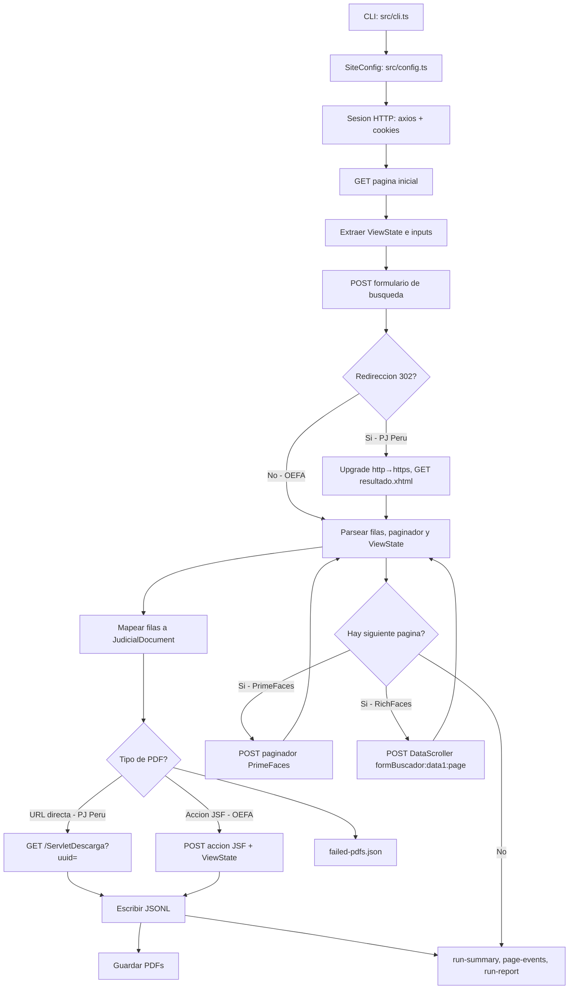
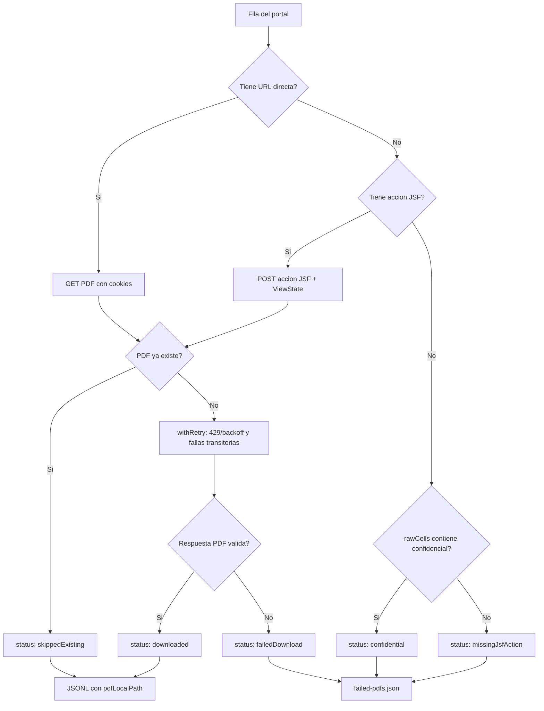
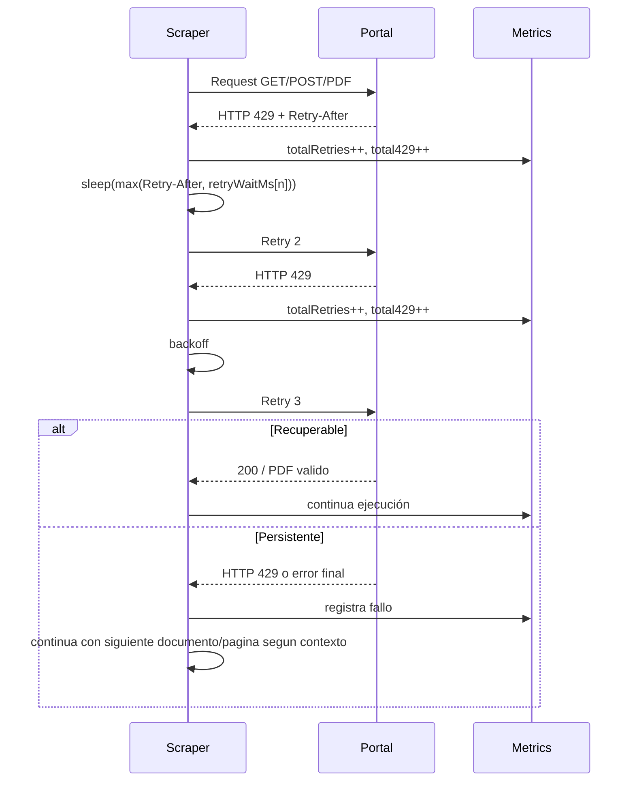
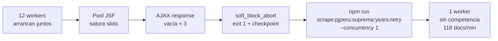

# pj-peru-scraper

Scraper HTTP en TypeScript para portales JSF peruanos, sin automatizacion de navegador. Soporta dos variantes: OEFA (PrimeFaces) y PJ Peru (RichFaces). Ambos sitios validados con extraccion real y descarga de PDFs.

## Quick Start

```bash
npm install
npm run build
npm run verify:local
```

ejecución controlada OEFA (100 docs + PDFs):

```bash
npm run scrape:oefa:test100
```

ejecución PJ Peru (requiere VPN/proxy peruano):

```bash
node dist/cli.js --site pj-peru --limit 10 --pdfs \
  --pdf-dir output/pjperu/pdfs \
  --out output/pjperu/pj-peru-documents.jsonl
```

Todos los sectores OEFA en paralelo:

```bash
npm run scrape:oefa:parallel
```

Simulacion reproducible de rate limiting:

```bash
npm run simulate:429
```

## Etapas de Verificación

Para evaluar el scraper sin necesidad de correr extracciones completas. Cada etapa es independiente y acotada en tiempo.

| Etapa | Comando | Requisito | Tiempo | Qué valida |
| --- | --- | --- | --- | --- |
| **0 — Build** | `npm run build` | Ninguno | ~5s | TypeScript compila sin errores |
| **1 — Simulate 429** | `npm run simulate:429` | Ninguno | ~10s | Retry/backoff determinístico local |
| **2 — OEFA smoke** | `npm run scrape:oefa:test100` | Red pública | ~7min | Extracción real + PDFs, sin VPN |
| **3 — OEFA paralelo** | `npm run scrape:oefa:parallel` | Red pública | ~3min | 5 sectores en paralelo, ~1,700 docs |
| **4 — PJ Peru dry-run** | `node dist/cli.js --site pj-peru --dry-run --limit 20` | VPN Perú | ~1min | Sesión JSF + búsqueda + paginación |
| **5 — PJ Peru acotado** | `npm run scrape:pjperu:districts:test` | VPN Perú | ~5min | 34 distritos × 50 docs, con PDFs |

### Etapa 0 — Build

```bash
npm install
npm run build
```

Salida esperada: `tsc` sin output (cero errores). El compilador falla si hay tipos rotos.

### Etapa 1 — Simulate 429 (sin red)

```bash
npm run simulate:429
```

Salida esperada:
```json
{ "ok": true, "recoverable": { "outcome": "ok" }, "persistent": { "outcome": "failed-after-retries" } }
```

Valida el comportamiento de retry sin depender del servidor real.

### Etapa 2 — OEFA smoke (red pública, sin VPN, ~7min)

```bash
npm run scrape:oefa:test100
```

Qué revisar al terminar:
- `output/run-summary.json` → `totalDocumentsCollected: 100`, `total429: 0`
- `output/pdfs/` → al menos 80 PDFs (el resto son confidenciales de OEFA, no errores)
- `output/failed-pdfs.json` → los que aparezcan como `"status":"confidential"` son esperados

### Etapa 3 — OEFA paralelo (red pública, ~3min)

```bash
npm run scrape:oefa:parallel
```

Lanza 5 sectores en paralelo. Al terminar el más lento (~3min), revisa la carpeta de salida timestamped en `output/runs/`. Confirmar ~1,700 docs totales entre los 5 sectores.

### Etapa 4 — PJ Peru dry-run (requiere VPN Perú activa)

Verificar VPN antes de correr:
```bash
curl -s https://jurisprudencia.pj.gob.pe/jurisprudenciaweb/faces/page/inicio.xhtml -o /dev/null -w "%{http_code}\n"
# Debe retornar 200
```

```bash
node dist/cli.js --site pj-peru --dry-run --limit 20
```

Salida esperada en el log: `Search complete`, `Page scraped`, exactamente 20 docs en 2 páginas. Sin escritura a disco.

### Etapa 5 — PJ Peru acotado con PDFs (requiere VPN Perú, ~5min)

```bash
npm run scrape:pjperu:districts:test
```

Lanza 34 workers de distrito con límite de 50 docs cada uno. Al terminar, revisa:
- `output/pjperu-districts/all-districts.jsonl` → ~1,700 líneas
- `output/pjperu-districts/pdfs/` → PDFs descargados
- Workers con `completed: false` en su checkpoint son reintentables con `--resume`

---

## Scripts Principales

| Script | Uso |
| --- | --- |
| `npm run build` | Compila TypeScript |
| `npm run ci` | Typecheck + build + lint + tests — validacion completa |
| `npm run verify:local` | Build + simulacion 429 sin VPN ni red externa |
| `npm run simulate:429` | Prueba local de backoff 429, sin depender del servidor real |
| `npm run probe:oefa:429` | Probe agresivo contra OEFA real para observar si emite 429 |
| `npm run scrape:oefa:test100` | ejecución controlada de 100 documentos OEFA + PDFs |
| `npm run scrape:oefa:parallel` | Los 5 sectores OEFA en paralelo (~3 min total vs ~12 min secuencial) |
| `npm run scrape:oefa:parallel:resume` | Retoma ejecución OEFA paralela desde checkpoint |
| `npm run scrape:oefa:parallel:dry` | Dry-run paralelo OEFA sin escribir datos |
| `npm run scrape:pjperu:districts:dry` | Smoke test PJ Peru Superior por distritos, requiere VPN |
| `npm run scrape:pjperu:districts:test` | Prueba acotada con PDFs por distritos (~5 min, requiere VPN) |
| `npm run scrape:pjperu:districts` | Extraccion completa Superior 34 distritos (~3h con VPN) |
| `npm run scrape:pjperu:districts:resume` | Retoma distritos desde checkpoint |
| `npm run scrape:pjperu:suprema:years:dry` | Dry-run Suprema 4 años sin escribir datos, requiere VPN |
| `npm run scrape:pjperu:suprema:years:test` | Prueba acotada Suprema 4 años × 500 docs, requiere VPN |
| `npm run scrape:pjperu:suprema:years` | Extraccion completa Suprema 2007–2026 (~2h con VPN) |
| `npm run scrape:pjperu:suprema:years:resume` | Retoma Suprema desde checkpoint |
| `npm run scrape:pjperu:suprema:years:retry` | Reintenta años con soft-block a concurrency 1 (ver `docs/retry-policy.md`) |

## Rendimiento Observado

Métricas reales medidas en run 2026-06-27 con VPN peruana compartida.

### PJ Peru — Corte Suprema (sin PDFs, metadata pura)

| Métrica | Valor |
| --- | --- |
| Workers simultáneos | 10–12 (particionado por año 2007–2026) |
| Velocidad por worker | 80–120 docs/min |
| Velocidad agregada | ~800–1,000 docs/min |
| Docs en 75 min (10 años activos) | 43,000+ |
| 429 detectados | 0 — el portal usa soft-block silencioso |
| Años con soft-block | 12/20 — solucionados con `years:retry` |
| Velocidad en retry (concurrency 1) | 105–120 docs/min — 46% más rápido que en paralelo |

```bash
# Para ver la velocidad sin esperar PDFs:
npm run scrape:pjperu:suprema:years:test   # 4 años × 500 docs en ~5 min
```

### PJ Peru — Corte Superior (con PDFs)

Run validado 2026-06-27: `npm run scrape:pjperu:districts:test` — 34 distritos, 12 workers, límite 500 docs/distrito.

| Métrica | Valor |
| --- | --- |
| Workers simultáneos | 12 de 34 distritos |
| Distritos completados | 19/34 OK — 15 soft-block (pool ViewState, recuperables con `--resume --concurrency 1`) |
| Velocidad pico por worker | 62 docs/min con PDFs incluidos |
| PDFs descargados | 499 en 25m56s |
| JSONL fusionado | 12.5 MB (`all-districts.jsonl`) |
| 429 detectados | 0 |
| Tiempo total | 25m56s |

### OEFA (con PDFs JSF POST)

Run validado 2026-06-27: `npm run scrape:oefa:parallel` — 5 sectores en paralelo.

| Sector | Docs | PDFs | Tiempo |
| --- | --- | --- | --- |
| MINERIA | 210 | 197 | 8m29s |
| HIDROCARBUROS | 220 | 200 | 11m42s |
| PESQUERIA | 210 | 194 | 13m12s |
| INDUSTRIA | 90 | 79 | 1m59s |
| **TOTAL** | **730** | **670** | **~14m** |

| Métrica | Valor |
| --- | --- |
| Sectores OK | 4/5 (ELECTRICIDAD: portal devolvió 0 resultados en este run — intermitente, no es bug) |
| PDFs confidenciales | ~6% del total — esperado, no son errores |
| Timeouts PDF | Reintentados 3× con jitter; si persisten → `failedDownload`, el run continúa |
| JSONL fusionado | 583 KB (`output/oefa/all-sectors.jsonl`) |
| 429 detectados | 0 |

> Los timeouts de PDF en OEFA son comportamiento esperado: el servidor JSF de OEFA tiene mayor latencia que PJ Peru. PESQUERIA agotó retries en la última página — el scraper guardó los 210 docs recolectados y terminó limpiamente con `exit 0`, demostrando el requisito "continue after persistent failure".

## Suite de Tests

```bash
npm test        # 53 tests unitarios
npm run ci      # typecheck + build + lint + tests — validación completa
```

Cobertura: parser HTML (PrimeFaces + RichFaces), downloader PDF (4 escenarios), retry/backoff con 429 simulado, documentMapper con contexto tipado.

## Arquitectura

El scraper no controla un navegador. Mantiene una sesion HTTP, conserva cookies, extrae `ViewState`, envia formularios JSF y parsea HTML con Cheerio. Soporta dos variantes de componentes JSF sin cambiar el nucleo.



## Flujo De PDFs

OEFA tiene documentos descargables y documentos confidenciales. Los confidenciales son documentos validos, pero el portal no expone PDF. El scraper los marca aparte para que no parezcan errores.



Interpretacion de estados:

| Estado | Significado | Accion |
| --- | --- | --- |
| `downloaded` | PDF descargado en esta ejecución | OK |
| `skippedExisting` | PDF ya estaba en disco | OK en resume/retry |
| `confidential` | OEFA no expone PDF por confidencialidad | Esperado, no es error |
| `missingJsfAction` | No se encontro URL ni accion JSF | Revisar selector si aumenta |
| `missingPdfUrl` | Documento sin URL directa | Normal en algunos sitios, depende del mapper |
| `failedDownload` | Hubo intento real y fallo | Reintentar o revisar red/portal/parser |

## Manejo De HTTP 429

El requisito pide detectar 429, aplicar backoff, continuar si persiste y registrar documentos fallidos. El scraper usa `withRetry()` en navegacion, paginacion y descarga de PDFs.



La prueba local no depende de que OEFA emita 429 en vivo:

```bash
npm run simulate:429
```

Salida esperada resumida:

```json
{
  "ok": true,
  "recoverable": {
    "attempts": 3,
    "retries": 2,
    "total429": 2,
    "outcome": "ok"
  },
  "persistent": {
    "attempts": 3,
    "retries": 3,
    "total429": 3,
    "outcome": "failed-after-retries"
  }
}
```

Esto demuestra dos escenarios del desafio:

| Escenario | Comportamiento validado |
| --- | --- |
| 429 recuperable | Espera, reintenta y sigue |
| 429 persistente | Agota intentos, registra metricas y falla controladamente |

Tambien existe un probe contra OEFA real:

```bash
npm run probe:oefa:429
```

Ese probe sirve para observar si el portal real empieza a limitar, pero no es necesario para demostrar la logica porque el servidor puede no emitir 429 durante una ejecución normal.

## Artefactos de Ejecución

Cada ejecución no `dry-run` escribe evidencia junto al JSONL de salida.


| Archivo | Proposito |
| --- | --- |
| `oefa-documents.jsonl` | Un documento por linea, amigable para cargas incrementales |
| `pdfs/*.pdf` | PDFs descargados |
| `run-summary.json` | Totales, metricas y rutas de artefactos |
| `page-events.jsonl` | Evento estructurado por pagina |
| `run-report.md` | Resumen humano de la ejecución |
| `failed-pdfs.json` | Inventario de confidenciales, missing y fallos reales |
| `checkpoint_*.json` | Estado para `--resume` |

## Opciones Del CLI

| Opcion | Uso |
| --- | --- |
| `--site oefa` | Portal OEFA (PrimeFaces, sin VPN) |
| `--site pj-peru` | Portal PJ Peru (RichFaces, requiere VPN Peru) |
| `--sector 1` | OEFA: `1=MINERIA`, `2=ELECTRICIDAD`, `3=HIDROCARBUROS`, `8=PESQUERIA`, `9=INDUSTRIA`. PJ Peru: `1=SUPREMA`, `2=SUPERIOR` |
| `--district 18` | PJ Peru solamente: filtra por distrito judicial (ej. `18=Lima`). Usado por `parallel-districts.mjs`. |
| `--discover-sectors` | Lee sectores desde el portal y termina |
| `--limit 100` | Limita documentos (util para pruebas de menos de 10 min) |
| `--pdfs` | Activa descarga de PDFs |
| `--pdf-dir <dir>` | Directorio de PDFs |
| `--pdf-concurrency 20` | Maximo de descargas PDF concurrentes por pagina |
| `--fresh-output` | Opcion legacy para ejecuciones controladas. Evitar en PJ Peru; preferir carpetas timestamped. |
| `--resume` | Retoma desde checkpoint por sitio/sector/distrito |
| `--dry-run` | Recorre y loguea sin escribir salida |
| `--proxy <url>` | Proxy HTTP/HTTPS para PJ Peru o redes restringidas |

## Checkpoints Y Resume

Los checkpoints viven en `output/checkpoint_{site}_s{sectorId}.json`.

Con `--resume`, el scraper:

1. Carga el checkpoint del sector.
2. Abre una sesion nueva.
3. Reenvia la busqueda.
4. Reproduce POSTs de paginacion hasta la pagina guardada.
5. Continua desde ahi.
6. Marca `completed: true` solo al terminar el sector.

Para auditoria limpia en PJ Peru, usar una carpeta de salida nueva o los runners timestamped. Para continuidad operacional, usar `--resume`.

## Paralelizacion Por Distrito — Por Que Y Como

### El problema: un solo proceso para 459k documentos es demasiado lento

La Corte Superior tiene ~459,000 documentos distribuidos en 34 distritos judiciales (Lima, Arequipa, Cusco, etc.). Si se consultan todos juntos (`buDistrito=0`, "Todos"), el scraper los navega en serie: pagina 1, pagina 2, ... pagina 45,891. Con el portal respondiendo a ~4-5 segundos por pagina, eso son **~51 horas** de ejecución continua.

### La solucion: un proceso por distrito

Cada distrito tiene ~13,500 documentos en promedio. Si lanzamos 20 procesos en paralelo, cada uno filtrando un distrito diferente, el tiempo se reduce a **2 rondas de ~90 minutos = ~3 horas** para toda la Corte Superior.

```
Sin paralelismo:  1 proceso × 45,891 pages × 5s = 51h
Con paralelismo: 34 distritos ÷ 20 workers × 1,350 pages × 5s ≈ 3h
```

### Root cause: saturacion del pool de sesiones JSF

En el test inicial con 20 workers sin jitter, 7 de 34 distritos fallaron (79% de exito). Los errores no eran HTTP 429 — eran respuestas AJAX vacias (`Partial AJAX response empty`). Esto es saturacion silenciosa del servidor, no rate limiting formal.

**Por que ocurre:** El servidor JSF/RichFaces mantiene un pool de sesiones y ViewStates activos en memoria. Cuando 20 procesos arrancan exactamente al mismo tiempo y todos hacen GET + POST de busqueda en el mismo segundo, el pool se satura y algunos requests reciben respuestas vacias en lugar de un error explicito.

**Las 4 mejoras implementadas:**

| Mejora | Donde | Efecto |
| --- | --- | --- |
| **Startup jitter** | `parallel-districts.mjs` | Cada worker espera `slotIdx × 600ms + random(800ms)` antes de arrancar. Los 20 workers se distribuyen en ~14 segundos en lugar de arrancar todos a la vez. Elimina la saturacion inicial. |
| **Full jitter en retries** | `src/session/retry.ts` | Los reintentos usan `base/2 + random(base/2)` en lugar de tiempos fijos. Evita que todos los workers fallidos reintenten al mismo segundo, lo que volveria a saturar el servidor. |
| **Inter-page delay 300–700ms** | `src/config.ts` + `src/scraper/sectorScraper.ts` | Delay aleatorio ANTES de cada `fetchNextPage`. Workers que empiezan a la vez y navegan al mismo ritmo se van desincronizando pagina a pagina — la carga AJAX se distribuye en el tiempo en lugar de llegar en oleadas sincronizadas. Pendiente validar impacto en tasa de exito. |
| **`setMaxListeners(0)`** | `parallel-districts.mjs` | Suprime el warning de Node.js sobre event listeners al tener 20+ streams activos en stdout/stderr y en el WriteStream de fusion. No afecta funcionalidad. |

### Comandos de paralelismo distrital

```bash
# Validacion rapida — 34 distritos x 5 docs, sin PDFs (~2 min)
npm run scrape:pjperu:districts:dry

# Test de 10 minutos — 34 distritos x 50 docs, con PDFs (~3-5 min)
npm run scrape:pjperu:districts:test

# ejecución completa — Superior completo con PDFs (~3h con VPN)
npm run scrape:pjperu:districts

# Reanudar si se interrumpe
npm run scrape:pjperu:districts:resume
```

Los archivos de salida se generan por distrito y luego se fusionan automaticamente:
```
output/pjperu-districts/
  district-18-LIMA.jsonl       # docs del Distrito Lima
  district-4-AREQUIPA.jsonl    # docs de Arequipa
  ...
  all-districts.jsonl          # fusion de todos los OK
  pdfs/                        # PDFs descargados
```

### Retry De Distritos Fallidos

Los distritos que terminaron con pocos registros (AYACUCHO, CALLAO, LIMA\_NORTE, CANETE, AMAZONAS, HUANUCO) fallaron por saturacion del pool JSF en el primer batch. Se pueden reintentar individualmente con `--concurrency 1` para que no compitan con ningun otro worker. El mismo patron aplica a Suprema — ver `docs/retry-policy.md` para el analisis completo y evidencia empirica (82 → 120 docs/min).

```bash
# Un distrito a la vez — sin competencia, sin saturacion
for DISTRICT in 5 7 9 8 1 12; do
  node dist/cli.js --site pj-peru --sector 2 \
    --district $DISTRICT \
    --pdfs --pdf-dir output/pjperu-districts/pdfs \
    --pdf-concurrency 15 \
    --out output/pjperu-districts/district-$(printf '%02d' $DISTRICT)-retry.jsonl
done
```

Por que `--concurrency 1` funciona: el fallo original fue que 12 procesos arrancan juntos y saturan el ViewState pool. Un proceso solo nunca compite con nadie — puede extraer la pagina completa del distrito sin recibir respuestas AJAX vacias.

## Paralelizacion Por Año — Corte Suprema

### El problema: Suprema no tiene filtro de distrito

A diferencia de la Corte Superior, la Suprema no expone un campo de distrito judicial. No hay forma de particionar la búsqueda por región. Todos los ~207,000 documentos están en un único resultado paginado.

### La solución: un proceso por año

El buscador acepta un rango de fechas. Si cada worker filtra un año distinto (2007, 2008, ... 2026), los 20 workers corren búsquedas completamente disjuntas — sin solapamiento de páginas, sin duplicados.

```
Sin paralelismo:  1 proceso × ~20,700 páginas × 0.5s = ~170 min (~2.8h)
Con paralelismo: 20 años ÷ 12 workers → 2 rondas × ~50 min = ~1.5h
```

### Evidencia del run 2026-06-27

| Métrica | Valor |
| --- | --- |
| Workers paralelos | 12 (2007–2026) |
| Docs extraídos (10 años activos) | 43,000+ en ~75 min |
| Velocidad sostenida por worker | 80–89 docs/min |
| Velocidad total agregada | ~800 docs/min |
| Años con soft-block | 12 de 20 (saturación de pool JSF) |
| Velocidad en retry (concurrency 1) | 105–120 docs/min por año |

### El problema del pool JSF en runs paralelos

Cuando 12 workers arrancan y abren sesiones JSF simultáneamente, el servidor no puede mantener todos los ViewState slots activos. Algunos workers empiezan a recibir respuestas AJAX vacías — el portal no emite HTTP 429, simplemente devuelve HTML vacío.

El scraper detecta 3 respuestas vacías consecutivas (`CONSECUTIVE_EMPTY_ABORT = 3`), guarda un checkpoint y termina con exit 1. Esto es un **soft-block**, no un crash.



Ver `docs/retry-policy.md` para el análisis completo, con datos empíricos y comparativa de velocidad.

### Comandos

```bash
# Primera extracción — 20 años, 12 workers en paralelo (~1.5h con VPN)
npm run scrape:pjperu:suprema:years

# Dry-run — valida sin escribir datos (~2 min con VPN)
npm run scrape:pjperu:suprema:years:dry

# Test acotado — 4 años recientes, max 500 docs por año (~10 min con VPN)
npm run scrape:pjperu:suprema:years:test

# Retry de años con soft-block — concurrency 1, sin saturación de pool
npm run scrape:pjperu:suprema:years:retry

# Retomar si se interrumpe por red o VPN
npm run scrape:pjperu:suprema:years:resume
```

### Arquitectura Paralela — Diagrama Excalidraw

El archivo `docs/parallel-architecture.excalidraw` contiene el diagrama completo con tres secciones:

- **ACTUAL**: bottleneck por acoplamiento scrape+PDF dentro del loop de paginacion
- **OPTIMIZADO**: 2 fases independientes (JSONL rapido, PDF desacoplado)
- **FUTURO**: fichaFetcher como tercer pase de enriquecimiento

Para abrir: importar en [excalidraw.com](https://excalidraw.com) o instalar la extension Excalidraw en VS Code.

## Optimizacion PDF: Skip Existing y Two-Phase Strategy

El downloader siempre revisa si el PDF ya existe en disco antes de hacer la peticion HTTP. Si existe, lo marca como `skippedExisting` y sigue. Esto significa que:

- **Retries son gratuitos**: reintentar un distrito no re-descarga PDFs que ya estan.
- **Rondas sucesivas son fast**: la segunda ejecución de produccion solo descarga los PDFs que no tiene.
- **PDFs y metadatos son independientes**: se puede correr sin `--pdfs` para extraer JSONL rapido, y luego correr solo PDFs en una segunda fase.

La extraccion de metadatos (JSONL) es significativamente mas rapida que la descarga de PDFs porque cada request AJAX devuelve 10 documentos en una sola respuesta HTML, mientras que cada PDF requiere una conexion GET independiente:

```
JSONL: 1 request AJAX/pagina × 10 docs = ~0.5s/10 docs = ~0.05s/doc
PDF:   1 request GET por doc × ~2s latencia = 2s/doc

Ratio:  scraping = 3% del tiempo total
        PDFs     = 97% del tiempo total
        → desacoplarlos elimina el bottleneck
```

**Ganancia estimada (dataset completo 459k docs):**

| Estrategia | JSONL | PDFs | Total |
| --- | ---: | ---: | ---: |
| Actual (acoplado) | 3h | 41h dentro del loop | ~44h |
| Optimizado 2 fases | 3h fase 1 | 5h fase 2 (50 conc.) | ~5h |
| **Ganancia** | — | — | **9x speedup** |

Estrategia optima para dataset completo:

```bash
# Fase 1 — extraer todos los metadatos primero (~3h, sin PDFs)
node scripts/parallel-districts.mjs --concurrency 12

# Fase 2 — descargar PDFs con alta concurrencia desde JSONL existente (~5h)
# sin tocar JSF session, sin bloquear paginacion
# node scripts/pdf-only.mjs --input output/pjperu-districts/all-districts.jsonl --concurrency 50
# (pendiente implementar — scripts/pdf-only.mjs)
```

**Por que la Fase 2 puede usar concurrencia 50 sin saturar:** `pdf-only.mjs` solo hace GET a `/ServletDescarga?uuid=X`. No crea sesiones JSF, no envia ViewState, no usa el pool de sesiones del servidor. El unico limite es el ancho de banda y el rate-limit de `/ServletDescarga`, que en produccion no ha mostrado 429.

## Estrategia De Extraccion Masiva PJ Peru

El dataset completo (~666k docs) no requiere descargarse de una sola vez. La estrategia optima:

### Opcion A — Distritos paralelos (recomendada, ~4h total)

```bash
# Suprema en paralelo por año + Superior en 34 distritos paralelos
npm run scrape:pjperu:suprema:years &
npm run scrape:pjperu:districts
# Suprema termina en ~2h. Superior en ~3h. Corren en paralelo.
# Si algún año de Suprema hace soft-block: npm run scrape:pjperu:suprema:years:retry
```

### Opcion B — Solo metadatos primero, PDFs despues

```bash
# Fase 1: JSONL sin PDFs (mucho mas rapido)
npm run scrape:pjperu:districts  # sin --pdfs en package.json, editar si se prefiere

# Fase 2 (pendiente implementar): leer JSONL y descargar PDFs sin re-navegar el portal
# node scripts/pdf-only.mjs --input output/pjperu-districts/all-districts.jsonl --concurrency 50
```

### Tabla de escenarios (referencia)

| Escenario | Docs | Tiempo estimado |
| --- | ---: | --- |
| Dry-run validacion | 5/distrito = 170 | ~1 min |
| Test 10 min (50/distrito) | 1,700 | ~3-5 min |
| Superior completo con distritos | ~459,000 | ~3h |
| Suprema completa (1 proceso) | ~207,000 | ~4h |
| Todo PJ Peru con paralelismo | ~666,000 | ~4h (paralelo) |

## PJ Peru — Diferencias Tecnicas Respecto A OEFA

PJ Peru usa **RichFaces 4.2.2 + Mojarra** (no PrimeFaces). Las diferencias relevantes:

| Aspecto | OEFA | PJ Peru |
| --- | --- | --- |
| Componente UI | PrimeFaces DataTable | RichFaces DataScroller + Repeat |
| Resultado | `<tr data-ri="N">` | `<div id="formBuscador:repeat:N:j_idt455">` |
| Paginacion AJAX | `_pagination=true` + `_first=N` | `formBuscador:data1:page=N` |
| Post-busqueda | POST directo | POST `inicio.xhtml` → 302 → GET `resultado.xhtml` |
| Redireccion | No | Si; servidor emite `http://` aunque se accede por `https://` — el scraper hace el upgrade manual |
| PDFs | POST accion JSF + ViewState | GET `/ServletDescarga?uuid=...` |
| VPN requerida | No | Si (IP peruana) |

Configuracion validada en `src/config.ts` bajo la clave `pj-peru`. Para correr:

```bash
# Con VPN peru activa:
node dist/cli.js --site pj-peru --limit 10 --dry-run
node dist/cli.js --site pj-peru --limit 100 --pdfs --pdf-dir output/pjperu/pdfs --out output/pjperu/pj-peru-documents.jsonl
```

## Mapa de Lectura del Codigo

Lee en este orden — cada capa depende de la anterior.

### Capa 1 — Contratos (lee primero)

Todo el resto del codigo habla en estos tipos. Leerlos primero hace que el resto sea obvio.

| Archivo | Que define |
| --- | --- |
| `src/types.ts` | `JudicialDocument`, `SiteConfig`, `ScrapeOptions` — las formas publicas del sistema |
| `src/models/internalTypes.ts` | `Session`, `ParsedPage`, `ParsedRow` — estado de runtime entre capas |
| `src/models/metrics.ts` | `RunMetrics`, `PdfFailure`, `PageEvent` — todo lo que se mide y registra |

### Capa 2 — Sesion HTTP

Como se establece y mantiene la conexion con el portal.

| Archivo | Que hace |
| --- | --- |
| `src/session/cookies.ts` | Jar manual: `absorbCookies` + `cookieHeader` — axios no persiste cookies solo |
| `src/session/rateLimit.ts` | Detecta rate-limit por contenido HTML (el portal devuelve 200, no 429) |
| `src/session/retry.ts` | `withRetry` — 3 intentos con full-jitter; desincroniza storms de workers paralelos |
| `src/session/session.ts` | Crea el cliente axios con 64 sockets y User-Agent Chrome; `fetchStartPage` abre sesion JSF |

### Capa 3 — Protocolo JSF

Los portales usan JavaServer Faces. Cada request HTTP tiene protocolo propio.

| Archivo | Que hace |
| --- | --- |
| `src/jsf/viewState.ts` | Extrae el token `javax.faces.ViewState` del HTML — necesario en cada POST |
| `src/jsf/partialResponse.ts` | Parsea respuestas AJAX `<partial-response>` de JSF — detecta respuestas vacias |
| `src/jsf/searchForm.ts` | Construye y envia el POST de busqueda con parametros de sector/distrito |
| `src/jsf/pagination.ts` | POST de navegacion AJAX — avanza de pagina en pagina sin recargar |

### Capa 4 — Parsers HTML

Transforman el HTML crudo en estructuras tipadas.

| Archivo | Que hace |
| --- | --- |
| `src/parser/paginatorParser.ts` | Lee el texto del paginador para extraer pagina actual, total de paginas y registros |
| `src/parser/rowParser.ts` | Extrae filas `<tr>` (PrimeFaces) o `<div>` repeat (RichFaces) como `ParsedRow[]` |
| `src/parser/documentMapper.ts` | Convierte un `ParsedRow` en un `JudicialDocument` — aplica columnas de `SiteConfig` |
| `src/parser/pageParser.ts` | Orquesta los parsers anteriores para producir un `ParsedPage` completo |

### Capa 5 — PDF

Dos estrategias segun el portal.

| Archivo | Que hace |
| --- | --- |
| `src/pdf/downloader.ts` | GET directo (`/ServletDescarga?uuid=`) para PJ Peru; POST JSF action para OEFA |
| `src/scraper/pdfBatch.ts` | `buildCandidates` clasifica docs; `downloadCandidate` despacha; batches concurrentes |

### Capa 6 — Bucle principal (el corazon)

| Archivo | Que hace |
| --- | --- |
| `src/scraper/sectorScraper.ts` | El loop completo: bootstrap → search → paginar → PDFs → checkpoint; soft-block detection |
| `src/scraper/scraper.ts` | Orquesta multiples sectores en el mismo proceso |

### Capa 7 — Entrada y paralelismo

| Archivo | Que hace |
| --- | --- |
| `src/config.ts` | Toda la configuracion por sitio: URLs, selectores CSS, columnas, tiempos, `rowParser` |
| `src/cli.ts` | Flags CLI, validacion, arranca `scraper.ts` |
| `scripts/parallel-sectors.mjs` | Lanza N procesos Node en paralelo, uno por sector OEFA |
| `scripts/parallel-suprema-years.mjs` | Lanza N procesos por año — gestiona soft-blocks y retry |

## Licencia

MIT.
