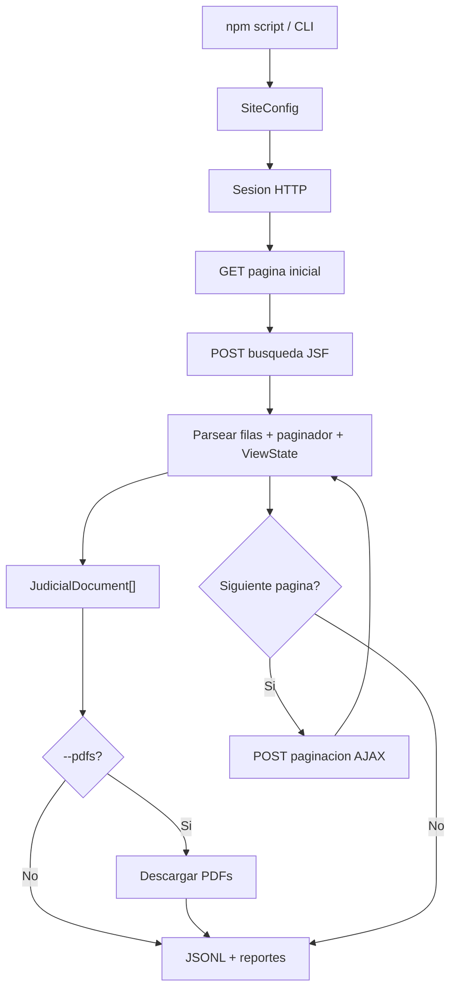

# pj-peru-scraper

Scraper HTTP en TypeScript para portales JSF peruanos. Usa axios + Cheerio, no automatiza navegador. Soporta OEFA (PrimeFaces) y PJ Peru (RichFaces), con paginacion JSF, checkpoints, salida JSONL y descarga opcional de PDFs.

## Contexto Rapido

El proyecto busca probar que el scraper corre de punta a punta:

- compila y pasa tests unitarios;
- maneja sesiones JSF reales sin browser automation;
- extrae paginas y documentos reales;
- descarga PDFs cuando el portal los expone;
- registra fallos recuperables sin truncar silenciosamente;
- corre en paralelo mediante comandos npm.

Evidencia actual: en una corrida real de Suprema por anio con VPN peruana, el scraper sostuvo cerca de una hora de extraccion, llego a ~43,750 documentos combinando run principal + retry, y demostro que los soft-blocks son contencion del pool JSF, no HTTP 429.

## Quick Start

```bash
npm install
npm run build
npm test
```

Prueba local sin portales reales:

```bash
npm run verify:local
```

Smoke test OEFA, sin VPN:

```bash
npm run scrape:oefa:test100
```

Smoke test PJ Peru, con VPN o proxy peruano:

```bash
npm run scrape:pjperu:smoke
```

## Ubuntu / Windows

Usar los comandos `npm run ...` como interfaz publica. Los scripts `.mjs` existen como implementacion interna, pero los wrappers npm evitan diferencias de shell entre Ubuntu, Windows y CI.

En Ubuntu:

```bash
npm ci
npm run ci
npm run verify:local
```

Para PJ Peru, primero confirmar VPN peruana:

```bash
curl -s https://jurisprudencia.pj.gob.pe/jurisprudenciaweb/faces/page/inicio.xhtml -o /dev/null -w "%{http_code}\n"
```

Debe devolver `200` antes de correr comandos PJ Peru.

## Guia De Pruebas Para El Reviewer

Correr en este orden. Los primeros 3 pasos no requieren internet ni VPN.

### Paso 1 — Sin internet (verificacion estatica)

```bash
npm ci            # instala dependencias exactas del lockfile
npm run ci        # typecheck + build + lint + 53 tests unitarios
```

Resultado esperado: `Tests  53 passed (53)`, sin errores tsc ni lint.

### Paso 2 — Sin internet (logica de retry)

```bash
npm run verify:local
```

Simula tres escenarios sin tocar ningun portal: 429 recuperable (3 intentos, exito), 429 persistente (3 intentos, falla controlada), y soft-block (3 paginas AJAX vacias consecutivas → abort). Imprime `"ok": true` con las tres secciones en JSON.

### Paso 3 — Internet publica, sin VPN (OEFA)

```bash
npm run scrape:oefa:test100
```

Extrae 100 documentos reales del portal publico OEFA + descarga sus PDFs. No requiere VPN. Al terminar verifica:
- `output/test100/oefa-documents.jsonl` — exactamente 100 lineas
- `output/test100/pdfs/` — archivos `.pdf` presentes
- `output/test100/run-summary.json` — totales y metricas

### Paso 4 — VPN peruana activa (PJ Peru smoke)

Confirmar conectividad primero:

```bash
curl -s --max-time 5 -o /dev/null -w "%{http_code}\n" https://jurisprudencia.pj.gob.pe/jurisprudenciaweb/faces/page/inicio.xhtml
```

Debe retornar `200`. Luego:

```bash
npm run scrape:pjperu:smoke
```

Conecta al portal, hace la busqueda JSF y parsea 20 documentos en dry-run (no escribe nada). Confirma que la sesion, el formulario de busqueda y el parser funcionan con el portal real.

### Paso 5 — VPN peruana activa (tests acotados con datos reales)

```bash
npm run scrape:pjperu:suprema:years:test   # 4 anios x 500 docs + PDFs, ~6 min
npm run scrape:pjperu:districts:test       # 34 distritos + PDFs, ~25 min
```

Estos son los tests de integracion completos. Producen documentos reales, PDFs descargados y reportes en `output/`.

**Feature clave a verificar — soft-block detection:**

En las corridas reales de PJ Peru no se observo HTTP 429. Lo que si ocurrio fue su
equivalente: el portal devolvio HTTP 200 con AJAX vacio durante paginas consecutivas
(soft-block por contencion del pool JSF). El scraper lo detecta y lo registra.

El soft-block solo se dispara con alta concurrencia y carga real del portal, por lo que
no es reproducible de forma determinista contra el servidor. La logica esta cubierta por:

```bash
npm run verify:local
```

El output incluye la seccion `"softBlock"` confirmando que 3 paginas vacias consecutivas
disparan `"abort"` en el page index 2 (umbral `CONSECUTIVE_EMPTY_ABORT = 3`).


### Paso 6 — Verificar logica de 429 contra portal real (opcional)

```bash
npm run probe:oefa:429
```

Sonda el portal OEFA con 500 requests concurrentes para encontrar el threshold de rate limiting. Imprime `[PASS]` si detecta 429, `[WARN]` si no. Solo util para calibrar `PDF_CONCURRENCY`.

---

| Comando | Requiere VPN | Tiempo aprox |
| --- | --- | --- |
| `npm run ci` | No | ~15 s |
| `npm run verify:local` | No | ~3 s |
| `npm run scrape:oefa:test100` | No | ~2-5 min |
| `npm run scrape:pjperu:smoke` | Si | ~30 s |
| `npm run scrape:pjperu:suprema:years:test` | Si | ~6 min |
| `npm run scrape:pjperu:districts:test` | Si | ~25 min |

## Scripts Principales

| Script | Uso |
| --- | --- |
| `npm run simulate:429` | Simula retry/backoff 429 localmente |
| `npm run scrape:oefa:test100` | 100 documentos OEFA + PDFs |
| `npm run scrape:oefa:parallel` | Sectores OEFA en paralelo |
| `npm run scrape:pjperu:smoke` | Smoke PJ Peru directo por CLI |
| `npm run scrape:pjperu:districts:dry` | Smoke Superior por distritos, sin escribir datos |
| `npm run scrape:pjperu:districts:test` | Prueba acotada Superior con PDFs |
| `npm run scrape:pjperu:districts` | Extraccion Superior por distritos |
| `npm run scrape:pjperu:suprema:years:dry` | Smoke Suprema por anios |
| `npm run scrape:pjperu:suprema:years:test` | Prueba acotada Suprema por anios |
| `npm run scrape:pjperu:suprema:years` | Extraccion Suprema particionada por anio |
| `npm run scrape:pjperu:suprema:years:retry` | Retry secuencial de anios con soft-block |

## Configuracion Inicial: crear tu .env

Antes de correr cualquier comando, crear el archivo `.env` desde la plantilla:

```bash
cp .env.example .env
```

Para los tests de esta guia, el `.env` recomendado es:

```bash
# .env — ajustes recomendados para validar el proyecto completo
PDF_CONCURRENCY=4          # descargas PDF concurrentes por pagina (por defecto: 1)
PROBE_429_TOTAL=100        # requests para la sonda 429 (reducir para test rapido)
PROBE_429_CONCURRENCY=10   # concurrencia de la sonda (ajustar al umbral a testear)
```

Cargar las variables en la sesion de terminal actual:

```bash
# Linux / Mac / WSL:
export $(grep -v '^#' .env | xargs)

# Windows PowerShell:
Get-Content .env | Where-Object { $_ -notmatch '^#' -and $_ -ne '' } | ForEach-Object { $k,$v = $_ -split '=',2; [System.Environment]::SetEnvironmentVariable($k, $v, 'Process') }

# O simplemente setear inline por comando (no requiere cargar el archivo):
PDF_CONCURRENCY=4 npm run scrape:oefa:test100
```

Todas las variables tienen valores por defecto — el scraper funciona sin `.env`. Ver `.env.example` para la lista completa con descripciones.

## Politica De Retry Y Caso Real Encontrado

El scraper maneja dos familias de error de disponibilidad:

| Caso | Como se detecta | Que hace el scraper |
| --- | --- | --- |
| HTTP 429 o timeout | Excepcion HTTP | `withRetry()` reintenta hasta 3 veces con jitter exponencial |
| Soft-block JSF | 3 HTTP 200 con AJAX vacio seguidos | Registra `soft_block_abort`, guarda checkpoint, permite `--resume` |

**El caso real encontrado en produccion fue el soft-block, no el 429.**

En las corridas de PJ Peru Suprema con 12 workers en paralelo, el portal devolvio HTTP 200
con cuerpo AJAX vacio en lugar de un codigo de error explicito. Es el equivalente funcional
del 429: el portal deja de entregar datos silenciosamente porque los workers compiten por
el mismo ViewState del pool JSF.

El scraper lo detecta, lo registra y no trunca el resultado:

```bash
# Ver eventos de soft-block en una corrida real:
grep "soft_block" output/*/page-events.jsonl

# Reanudar con un solo worker para eliminar la contencion:
npm run scrape:pjperu:suprema:years:retry
```

Para validar la logica de retry sin necesitar ningun portal:

```bash
npm run verify:local
```


## Artefactos De Ejecucion

| Archivo | Proposito |
| --- | --- |
| `*.jsonl` | Un documento por linea |
| `pdfs/*.pdf` | PDFs descargados |
| `run-summary.json` | Totales y metricas principales |
| `page-events.jsonl` | Eventos por pagina |
| `run-report.md` | Resumen humano de la corrida |
| `failed-pdfs.json` | PDFs confidenciales, missing o fallidos |
| `checkpoint_*.json` | Estado para `--resume` |

## Flujo General



## PDFs

PJ Peru expone PDFs por URL directa. OEFA usa acciones JSF con `ViewState`; algunos documentos son confidenciales y no exponen PDF. Esos casos se registran como `confidential`, no como error del scraper.

| Estado | Significado |
| --- | --- |
| `downloaded` | PDF descargado |
| `skippedExisting` | PDF ya existia en disco |
| `confidential` | Documento valido sin PDF publico |
| `missingJsfAction` | No se encontro accion JSF para descargar |
| `missingPdfUrl` | Documento sin URL directa |
| `failedDownload` | Hubo intento real y fallo |

## Paralelizacion

La interfaz recomendada siempre es npm:

```bash
npm run scrape:oefa:parallel
npm run scrape:pjperu:districts
npm run scrape:pjperu:suprema:years
```

Los runners internos particionan el trabajo:

- OEFA: por sector;
- PJ Peru Superior: por distrito judicial;
- PJ Peru Suprema: por anio, porque no tiene filtro de distrito.

## Mapa de Lectura del Codigo

Lee en este orden. Cada capa depende de la anterior.

### Capa 1 - Contratos

| Archivo | Que define |
| --- | --- |
| `src/types.ts` | `JudicialDocument`, `SiteConfig`, `ScrapeOptions` |
| `src/models/internalTypes.ts` | `Session`, `ParsedPage`, `ParsedRow`, `$Root` |
| `src/models/metrics.ts` | `RunMetrics`, `PdfFailure`, `PageEvent`, `PdfDownloadResult` |
| `src/models/scraperTypes.ts` | `SectorResult`, `SectorContext`, `PageMetrics`, `AdvancePageCtx` |
| `src/models/pdfTypes.ts` | `PagePdfStats`, `PdfBatchInput`, `PdfCandidate`, `PdfDownloadConfig` |
| `src/models/jsfTypes.ts` | `PaginationRequest` y tipos JSF |

### Capa 2 - Sesion HTTP

| Archivo | Que hace |
| --- | --- |
| `src/session/cookies.ts` | Jar manual de cookies |
| `src/session/rateLimit.ts` | Detecta rate-limit por contenido o 429 |
| `src/session/retry.ts` | Retry con jitter |
| `src/session/session.ts` | Cliente axios, headers, sockets y start page |

### Capa 3 - Protocolo JSF

| Archivo | Que hace |
| --- | --- |
| `src/jsf/viewState.ts` | Extrae `javax.faces.ViewState` del HTML inicial |
| `src/jsf/partialResponse.ts` | Parsea la envoltura XML de respuestas AJAX JSF |
| `src/jsf/actionLink.ts` | Parsea onclick `mojarra.jsfcljs` para links de PDF (OEFA) |
| `src/jsf/searchForm.ts` | Envia formulario de busqueda (AJAX o clasico con redirect) |
| `src/jsf/pagination.ts` | Avanza paginas por AJAX (PrimeFaces o RichFaces) |

### Capa 4 - Parsers HTML

| Archivo | Que hace |
| --- | --- |
| `src/parser/paginatorParser.ts` | Lee pagina actual, total y registros |
| `src/parser/rowParser.ts` | Extrae filas PrimeFaces o RichFaces |
| `src/parser/documentMapper.ts` | Convierte filas a `JudicialDocument` |
| `src/parser/pageParser.ts` | Construye un `ParsedPage` completo |

### Capa 5 - PDF

| Archivo | Que hace |
| --- | --- |
| `src/pdf/downloader.ts` | Descarga PDF directo o via accion JSF |
| `src/scraper/pdfBatch.ts` | Clasifica candidatos y descarga en batches |

### Capa 6 - Scraping

| Archivo | Que hace |
| --- | --- |
| `src/scraper/sectorScraper.ts` | Bootstrap, busqueda, paginacion, PDFs y checkpoint |
| `src/scraper/scraper.ts` | Orquesta sectores dentro de un proceso |
| `src/scraper/sectorDiscovery.ts` | Descubre sectores disponibles |

### Capa 7 - Entrada y Paralelismo

| Archivo | Que hace |
| --- | --- |
| `package.json` | Comandos npm portables para Ubuntu, Windows y CI |
| `src/config.ts` | Configuracion por sitio: URLs, selectores, columnas y tiempos |
| `src/config/constants.ts` | Constantes numericas y strings del sistema |
| `src/cli.ts` | Flags CLI y arranque |
| `scripts/` | Implementaciones internas llamadas por los comandos npm |

## Licencia

MIT.
