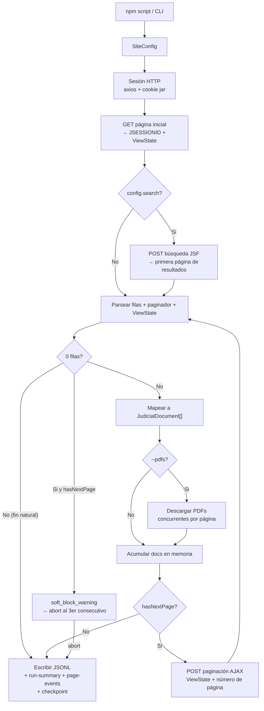

# pj-peru-scraper

Scraper HTTP en TypeScript para portales JSF peruanos. Usa axios + Cheerio, no automatiza navegador. Soporta OEFA (PrimeFaces) y PJ Peru (RichFaces), con paginación JSF, checkpoints, salida JSONL y descarga opcional de PDFs.

## Contexto Rápido

El proyecto busca probar que el scraper corre de punta a punta:

- compila y pasa tests unitarios;
- maneja sesiones JSF reales sin browser automation;
- extrae páginas y documentos reales;
- descarga PDFs cuando el portal los expone;
- registra fallos recuperables sin truncar silenciosamente;
- corre en paralelo mediante comandos npm.

Evidencia actual: en una corrida real de Suprema por año con VPN peruana, el scraper sostuvo cerca de una hora de extracción, llegó a ~43,750 documentos combinando run principal + retry, y demostró que los soft-blocks son contención del pool JSF, no HTTP 429.

## Configuración Inicial

Copiar la plantilla y editar los valores que necesites:

```bash
cp .env.example .env
```

El scraper carga `.env` automáticamente al arrancar. No es necesario exportar variables en la terminal. Ver `.env.example` para la lista completa con descripciones.

Para los tests de esta guía, el `.env` recomendado es:

```bash
# .env — ajustes recomendados para validar el proyecto completo
PDF_CONCURRENCY=4          # descargas PDF concurrentes por página (por defecto: 1)
PROBE_429_TOTAL=100        # requests para la sonda 429 (reducir para test rápido)
PROBE_429_CONCURRENCY=10   # concurrencia de la sonda (ajustar al umbral a testear)
```

## Guía De Pruebas

Correr en este orden. Los comandos npm funcionan igual en Ubuntu, Windows y CI — no invocar los scripts `.mjs` directamente. Los primeros 3 pasos no requieren internet ni VPN.

### Paso 1 — Sin internet (verificación estática)

```bash
npm ci            # instala dependencias exactas del lockfile
npm run ci        # typecheck + build + lint + 170 tests unitarios
```

Resultado esperado: `Tests  170 passed (170)`, sin errores tsc ni lint.

### Paso 2 — Sin internet (retry y soft-block)

```bash
npm run verify:local
```

Simula tres escenarios sin tocar ningún portal: 429 recuperable (3 intentos, éxito), 429 persistente (3 intentos, falla controlada), y soft-block (3 páginas AJAX vacías consecutivas → abort). Imprime `"ok": true` con las tres secciones en JSON.

```bash
npm run demo:soft-block
```

Levanta un servidor HTTP local en `127.0.0.1` que replica el patrón de soft-block del portal real: GET bootstrap entrega 2 documentos, los POST de paginación AJAX devuelven HTTP 200 con cuerpo vacío y next-button presente. Resultado esperado:

```
✓ scraped   page 1/?  docs=2
⚠ warning   page 2/?  docs=0
⚠ warning   page 3/?  docs=0
✖ ABORT     page 4/?  docs=0
```

`Page events emitted: 4`. No requiere VPN ni conexión de red.

### Paso 3 — Internet pública, sin VPN (OEFA)

```bash
npm run scrape:oefa:test100
```

Extrae 100 documentos reales del portal público OEFA + descarga sus PDFs. No requiere VPN. Al terminar verifica:
- `output/test100/oefa-documents.jsonl` — exactamente 100 líneas
- `output/test100/pdfs/` — archivos `.pdf` presentes
- `output/test100/run-summary.json` — totales y métricas

### Paso 4 — VPN peruana activa (PJ Peru smoke)

El portal bloquea IPs no peruanas con HTTP 403. Verificar que el nodo de salida es Peru antes de correr:

```bash
curl -s https://ipinfo.io/json | python3 -c "import sys,json; d=json.load(sys.stdin); print(d.get('country'), d.get('city'), d.get('org'))"
# Debe imprimir: PE  Lima  <ISP peruano>
```

Confirmar que el portal responde:

```bash
curl -s --max-time 5 -o /dev/null -w "%{http_code}\n" https://jurisprudencia.pj.gob.pe/jurisprudenciaweb/faces/page/inicio.xhtml
# Debe retornar: 200
```

Luego:

```bash
npm run scrape:pjperu:smoke
```

Conecta al portal, envía el formulario de búsqueda JSF y parsea 20 documentos en dry-run (no escribe nada al disco). Resultado esperado:

```
OK Session ready
OK Search complete  N records · M pages
  Página 1 de M   |   Tiempo: Xs
  + Documentos esta página  : 10
    Total acumulado         : 10
```

Confirma que la sesión HTTP, el ViewState JSF, el formulario de búsqueda y el parser RichFaces funcionan con el portal real.

### Paso 5 — VPN peruana activa (tests acotados con datos reales)

```bash
npm run scrape:pjperu:suprema:years:test   # 4 años x 500 docs + PDFs, ~6 min
npm run scrape:pjperu:districts:test       # 34 distritos + PDFs, ~25 min
```

Estos son los tests de integración completos. Producen documentos reales, PDFs descargados y reportes en `output/`.

### Paso 6 — Verificar lógica de 429 contra portal real (opcional)

```bash
npm run probe:oefa:429
```

Sonda el portal OEFA con 500 requests concurrentes para encontrar el threshold de rate limiting. Imprime `[PASS]` si detecta 429, `[WARN]` si no. Solo útil para calibrar `PDF_CONCURRENCY`.

---

| Comando | Requiere VPN | Tiempo aprox |
| --- | --- | --- |
| `npm run ci` | No | ~15 s |
| `npm run verify:local` | No | ~3 s |
| `npm run demo:soft-block` | No | ~5 s |
| `npm run scrape:oefa:test100` | No | ~2-5 min |
| `npm run scrape:pjperu:smoke` | Sí (Peru) | ~30 s |
| `npm run scrape:pjperu:suprema:years:test` | Sí (Peru) | ~6 min |
| `npm run scrape:pjperu:districts:test` | Sí (Peru) | ~25 min |

## Scripts Principales

| Script | Uso |
| --- | --- |
| `npm run simulate:429` | Simula retry/backoff 429 localmente |
| `npm run demo:soft-block` | Demo offline de detección de soft-block (servidor local) |
| `npm run scrape:oefa:test100` | 100 documentos OEFA + PDFs |
| `npm run scrape:oefa:parallel` | Sectores OEFA en paralelo |
| `npm run scrape:pjperu:smoke` | Smoke PJ Peru directo por CLI |
| `npm run scrape:pjperu:districts:dry` | Smoke Superior por distritos, sin escribir datos |
| `npm run scrape:pjperu:districts:test` | Prueba acotada Superior con PDFs |
| `npm run scrape:pjperu:districts` | Extracción Superior por distritos |
| `npm run scrape:pjperu:suprema:years:dry` | Smoke Suprema por años |
| `npm run scrape:pjperu:suprema:years:test` | Prueba acotada Suprema por años |
| `npm run scrape:pjperu:suprema:years` | Extracción Suprema particionada por año |
| `npm run scrape:pjperu:suprema:years:retry` | Retry secuencial de años con soft-block |

## Política De Retry Y Caso Real Encontrado

El scraper maneja dos familias de error de disponibilidad:

| Caso | Cómo se detecta | Qué hace el scraper |
| --- | --- | --- |
| HTTP 429 o timeout | Excepción HTTP | `withRetry()` reintenta hasta 3 veces con jitter exponencial |
| Soft-block JSF | 3 HTTP 200 con AJAX vacío seguidos | Registra `soft_block_abort`, guarda checkpoint, permite `--resume` |

**El caso real encontrado en producción fue el soft-block, no el 429.**

En las corridas de PJ Peru Suprema con 12 workers en paralelo, el portal devolvió HTTP 200
con cuerpo AJAX vacío en lugar de un código de error explícito. Es el equivalente funcional
del 429: el portal deja de entregar datos silenciosamente porque los workers compiten por
el mismo ViewState del pool JSF.

El scraper lo detecta, lo registra y no trunca el resultado. Para verlo sin VPN ni portal:

```bash
npm run demo:soft-block   # muestra la secuencia completa: scraped → warning → warning → ABORT
```

Si ocurre en una corrida real, el checkpoint queda guardado y se puede reanudar con un solo worker para eliminar la contención:

```bash
npm run scrape:pjperu:suprema:years:retry
```


## Artefactos De Ejecución

La carpeta de salida depende del comando:
- Scripts nombrados (`scrape:oefa:test100`, etc.) → carpeta fija definida en el script
- `scrape:pjperu:districts` → `output/runs/YYYY-MM-DD-HHMM/` con timestamp por corrida
- `scrape:oefa:parallel` → `output/oefa/` con un archivo por sector

Los PDFs van a una carpeta compartida entre corridas ya que sus nombres son idempotentes (mismo expediente = mismo archivo).

| Archivo | Propósito | Cuándo aparece |
| --- | --- | --- |
| `*.jsonl` | Un documento JSON por línea | Siempre, salvo `--dry-run` |
| `pdfs/*.pdf` | PDFs descargados del portal | Solo con `--pdfs` y sin `--dry-run` |
| `run-summary.json` | Totales, métricas y tiempos | Siempre, salvo `--dry-run` |
| `page-events.jsonl` | Evento por página: tipo, docs, PDFs, elapsed | Siempre, salvo `--dry-run` |
| `run-report.md` | Resumen legible en Markdown | Siempre, salvo `--dry-run` |
| `failed-pdfs.json` | PDFs confidenciales, missing o fallidos con motivo | Solo si hubo fallos de PDF |
| `checkpoint_*.json` | Sector + página + total para `--resume` | Siempre, salvo `--dry-run` |

## Flujo General



## PDFs

PJ Peru expone PDFs por URL directa. OEFA usa acciones JSF con `ViewState`; algunos documentos son confidenciales y no exponen PDF. Esos casos se registran como `confidential`, no como error del scraper.

| Estado | Significado |
| --- | --- |
| `downloaded` | PDF descargado |
| `skippedExisting` | PDF ya existía en disco |
| `confidential` | Documento válido sin PDF público |
| `missingJsfAction` | No se encontró acción JSF para descargar |
| `missingPdfUrl` | Documento sin URL directa |
| `failedDownload` | Hubo intento real y falló |

## Paralelización

La interfaz recomendada siempre es npm:

```bash
npm run scrape:oefa:parallel
npm run scrape:pjperu:districts
npm run scrape:pjperu:suprema:years
```

Los runners internos particionan el trabajo:

- OEFA: por sector;
- PJ Peru Superior: por distrito judicial;
- PJ Peru Suprema: por año, porque no tiene filtro de distrito.

## Mapa de Lectura del Código

El código se organiza en capas, cada una construida sobre la anterior. Si querés explorar el repositorio, este orden evita saltar entre contextos sin el setup previo.

### Capa 1 - Contratos

| Archivo | Qué define |
| --- | --- |
| `src/types.ts` | `JudicialDocument`, `SiteConfig`, `ScrapeOptions` |
| `src/models/internalTypes.ts` | `Session`, `ParsedPage`, `ParsedRow`, `$Root` |
| `src/models/metrics.ts` | `RunMetrics`, `PdfFailure`, `PageEvent`, `PdfDownloadResult` |
| `src/models/scraperTypes.ts` | `SectorResult`, `SectorContext`, `PageMetrics`, `AdvancePageCtx` |
| `src/models/pdfTypes.ts` | `PagePdfStats`, `PdfBatchInput`, `PdfCandidate`, `PdfDownloadConfig` |
| `src/models/jsfTypes.ts` | `PaginationRequest` y tipos JSF |

### Capa 2 - Sesión HTTP

| Archivo | Qué hace |
| --- | --- |
| `src/session/cookies.ts` | Jar manual de cookies |
| `src/session/rateLimit.ts` | Detecta rate-limit por contenido o 429 |
| `src/session/retry.ts` | Retry con jitter |
| `src/session/session.ts` | Cliente axios, headers, sockets y start page |

### Capa 3 - Protocolo JSF

| Archivo | Qué hace |
| --- | --- |
| `src/jsf/viewState.ts` | Extrae `javax.faces.ViewState` del HTML inicial |
| `src/jsf/partialResponse.ts` | Parsea la envoltura XML de respuestas AJAX JSF |
| `src/jsf/actionLink.ts` | Parsea onclick `mojarra.jsfcljs` para links de PDF (OEFA) |
| `src/jsf/searchForm.ts` | Envía formulario de búsqueda (AJAX o clásico con redirect) |
| `src/jsf/pagination.ts` | Avanza páginas por AJAX (PrimeFaces o RichFaces) |

### Capa 4 - Parsers HTML

| Archivo | Qué hace |
| --- | --- |
| `src/parser/paginatorParser.ts` | Lee página actual, total y registros |
| `src/parser/rowParser.ts` | Extrae filas PrimeFaces o RichFaces |
| `src/parser/documentMapper.ts` | Convierte filas a `JudicialDocument` |
| `src/parser/pageParser.ts` | Construye un `ParsedPage` completo |

### Capa 5 - PDF

| Archivo | Qué hace |
| --- | --- |
| `src/pdf/downloader.ts` | Descarga PDF directo o vía acción JSF |
| `src/scraper/pdfBatch.ts` | Clasifica candidatos y descarga en batches |

### Capa 6 - Scraping

Cada archivo tiene una sola responsabilidad. Los orquestadores (`sectorScraper.ts`, `scraper.ts`) usan comentarios de sección (`// ── Fase ──`) para que la ejecución se lea como una narrativa lineal sin tener que rastrear funciones auxiliares.

**Helpers de cálculo (sin red ni disco):**

| Archivo | Qué hace |
| --- | --- |
| `src/scraper/sectorHelpers.ts` | Límites, duraciones y detección de condiciones del paginador — funciones puras |
| `src/scraper/paginationHelpers.ts` | Fusión de estado de página y resolución de siguiente página; `advancePage` hace el POST HTTP |

**Detección y eventos:**

| Archivo | Qué hace |
| --- | --- |
| `src/scraper/softBlock.ts` | Evalúa contador de páginas vacías y emite warn/abort con log estructurado |
| `src/scraper/pageEvents.ts` | Construye y loguea el evento `PageEvent` por cada página procesada |

**Bucle de paginación (sectorScraper):**

| Archivo | Qué hace |
| --- | --- |
| `src/scraper/sectorScraper.ts` | Ciclo Bootstrap → Búsqueda → Páginas → PDFs → Checkpoint |

**Bucle de sectores (scraper):**

| Archivo | Qué hace |
| --- | --- |
| `src/scraper/sectorDiscovery.ts` | Descubre sectores disponibles en el portal |
| `src/scraper/sectorLoop.ts` | Resolución de sectores, reintento por sector y pausas entre sectores |
| `src/scraper/runStats.ts` | Calcula estadísticas finales y registra resúmenes de ejecución |
| `src/scraper/runOutput.ts` | Escribe JSONL y reporte de PDFs fallidos en disco |
| `src/scraper/scraper.ts` | Orquestador principal: Setup → Sectores → Salida → Métricas → Reporte |

### Capa 7 - Entrada y Paralelismo

| Archivo | Qué hace |
| --- | --- |
| `package.json` | Comandos npm portables para Ubuntu, Windows y CI |
| `src/config.ts` | Configuración por sitio: URLs, selectores, columnas y tiempos |
| `src/config/constants.ts` | Constantes numéricas y strings del sistema |
| `src/cli.ts` | Flags CLI y arranque |
| `scripts/` | Implementaciones internas llamadas por los comandos npm |

## Estado del Proyecto

**Veredicto: Near-Production** — auditoría técnica independiente sobre arquitectura, manejo de errores, cobertura de tests, TSDoc y CI.

**Fortalezas confirmadas:**

| Área | Resultado |
| --- | --- |
| Arquitectura | Capas limpias sin imports circulares; sin god modules |
| Manejo de errores | Retry/backoff con jitter completo; PDF downloads nunca lanzan excepción — retornan structs tipados |
| TSDoc | 114 bloques cubriendo todos los exports de la API pública; `@remarks`, `@param`, `@returns` en cada función |
| Tests | 170 tests con fake timers, mocked fs, concurrencia verificada; todas las rutas de PDF cubiertas |
| Observabilidad | Winston estructurado en cada evento del ciclo de vida; `PageEvent` trazable por página |

**3 gaps antes de producción completa:**

1. `validateOutput` usa `readFileSync` sobre el JSONL entero — riesgo de OOM en corridas de 43K+ documentos; debería hacer streaming o leer solo el head.
2. El loop de paginación en `sectorScraper.ts` no tiene tests unitarios — soft-block abort, heurísticas RichFaces y `scrapeSectorWithRetry` quedan sin cobertura de unidad.
3. CI no enforcea thresholds de coverage — una PR puede bajar de 80% a 20% y pasaría verde.

Estos tres gaps no afectan la corrida normal del scraper; son riesgos de mantenimiento y escala a largo plazo.

## Licencia

MIT.
