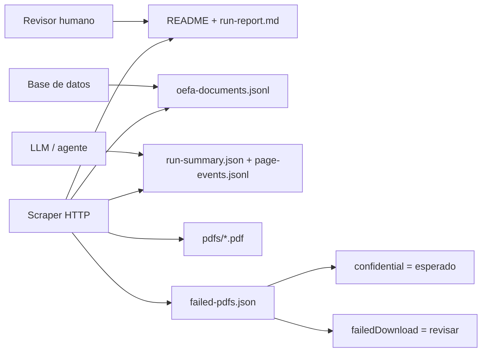
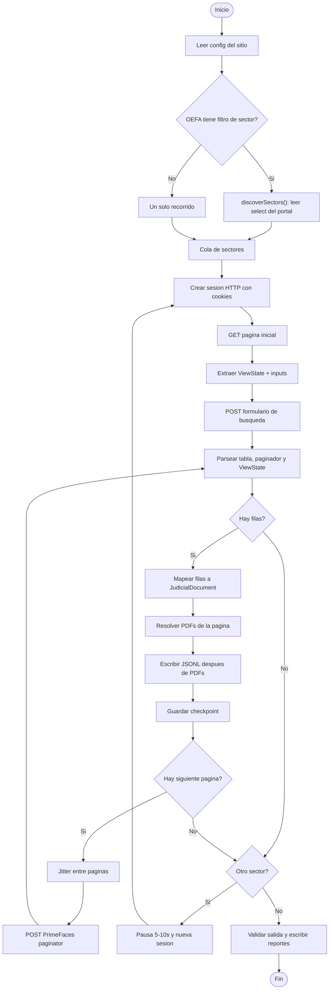
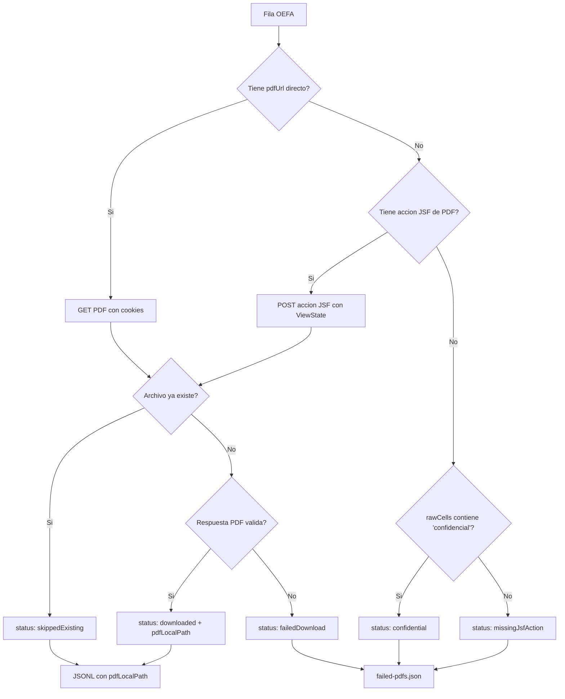
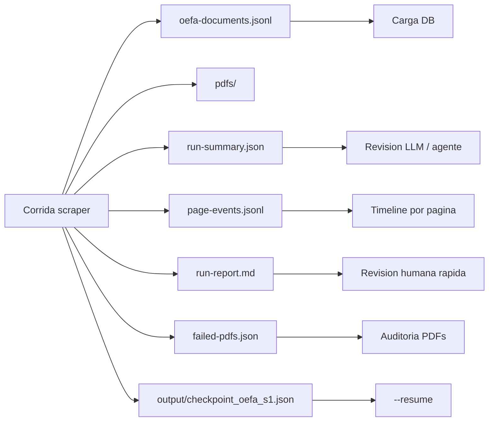

# pj-peru-scraper

Scraper HTTP en TypeScript para portales judiciales y ambientales del Peru.

El foco actual es OEFA: extraer resoluciones del Tribunal de Fiscalizacion Ambiental, descargar los PDFs disponibles, distinguir documentos confidenciales de fallas reales, y dejar evidencia revisable por humanos, bases de datos y LLMs. El scraper evita browser automation en el flujo principal: trabaja con `axios`, `cheerio`, cookies, `javax.faces.ViewState` y POSTs JSF/PrimeFaces.

## Estado Corto

El repo esta en Sprint 3. La base modular HTTP ya esta funcionando y el test controlado de 100 documentos OEFA esta validado.

| Area | Estado |
| --- | --- |
| OEFA HTTP scraper | Funcional |
| OEFA `test100` | Validado: 100 docs, 92 PDFs, 8 confidenciales, 0 fallas de descarga, 0 HTTP 429 |
| Confidenciales OEFA | Clasificados como `confidential`, no como error |
| Reportes de corrida | `run-summary.json`, `page-events.jsonl`, `run-report.md`, `failed-pdfs.json` |
| Display de terminal | Banners, fases, progreso de PDFs y resumen final |
| Sector MINERIA | Corrida parcial observada en `output/mineria` |
| PJ Peru | Pendiente de recon/validacion con IP peruana o proxy |

Estado observado en esta revision local:

| Artefacto | Valor |
| --- | ---: |
| `output/mineria/oefa-documents.jsonl` | 420 lineas |
| IDs unicos en mineria | 415 |
| Registros mineria con `pdfLocalPath` | 382 |
| PDFs en `output/mineria/pdfs` | 377 |
| Checkpoint mineria | `lastPageIndex: 41`, `totalScraped: 420`, `completed: false` |

Nota: los conteos de `pdfLocalPath` y archivos locales pueden diferir si el JSONL viene de corridas append/resume o si hubo archivos previos. Para auditoria final, usar `run-summary.json` cuando exista y regenerar con `--fresh-output` si se necesita una corrida limpia.

## Como Pensar El Sistema

El scraper no "navega una pagina" como una persona. Mantiene una sesion HTTP que aprende el estado JSF del portal, envia formularios, interpreta fragmentos PrimeFaces y convierte filas HTML en documentos JSONL. En cada pagina intenta descargar PDFs, pero OEFA puede marcar filas como confidenciales; esas filas son informacion valida sin PDF descargable.



## Comandos Principales

```bash
npm install
npm run build
```

```bash
# Corrida controlada: 100 documentos OEFA + PDFs + reportes
npm run scrape:oefa:test100

# Sector MINERIA desde cero, limpiando JSONL y failed-pdfs del destino
npm run scrape:oefa:mineria

# Reanudar MINERIA desde checkpoint
npm run scrape:oefa:mineria:resume

# Prueba separada para observar HTTP 429
npm run probe:oefa:429
```

El script `scrape:oefa:test100` ejecuta:

```bash
node dist/cli.js --site oefa --limit 100 --pdfs \
  --pdf-dir output/test100/pdfs \
  --out output/test100/oefa-documents.jsonl \
  --pdf-concurrency 4 \
  --fresh-output
```

Opciones utiles del CLI:

| Opcion | Uso |
| --- | --- |
| `--site oefa` | Portal objetivo. Tambien existe `pj-peru`, pendiente de validacion completa |
| `--sector 1` | Filtra OEFA por sector; `1` es MINERIA en el portal observado |
| `--discover-sectors` | Imprime sectores desde la pagina viva y termina |
| `--limit 100` | Limita documentos, util para pruebas controladas |
| `--pdfs` | Activa descarga de PDFs |
| `--pdf-dir <dir>` | Directorio de PDFs |
| `--pdf-concurrency 4` | Concurrencia para descargas candidatas |
| `--fresh-output` | Borra JSONL y `failed-pdfs.json` del destino antes de correr |
| `--resume` | Retoma desde checkpoint por sitio/sector |
| `--dry-run` | Recorre y loguea sin escribir salida |
| `--proxy <url>` | Proxy HTTP/HTTPS, util para PJ Peru |

## Flujo De Scraping



Puntos importantes para revisar codigo:

| Modulo | Responsabilidad |
| --- | --- |
| `src/cli.ts` | Parseo de flags, `--fresh-output`, arranque |
| `src/scraper/scraper.ts` | Orquestacion multi-sector, metricas y reportes |
| `src/scraper/sectorScraper.ts` | Flujo por sector: busqueda, paginacion, PDFs, checkpoint |
| `src/jsf/*` | ViewState, formularios, paginacion y respuestas parciales |
| `src/parser/*` | HTML a filas, paginas, documentos y paginador |
| `src/pdf/downloader.ts` | Descarga directa o por accion JSF |
| `src/output/runReport.ts` | Artefactos de revision |
| `src/display/terminal.ts` | Salida humana en terminal |

## Flujo De PDFs Y Confidenciales

OEFA no ofrece PDF para todas las filas. Algunas traen texto de confidencialidad en la tabla; el scraper las reporta como documentos validos con PDF no disponible.



Interpretacion recomendada:

| Estado | Significado | Accion |
| --- | --- | --- |
| `downloaded` | PDF descargado en esta corrida | OK |
| `skippedExisting` | PDF ya existia localmente | OK en resume/retry |
| `confidential` | OEFA no expone PDF por confidencialidad | Esperado, no es error |
| `missingJsfAction` | No se encontro URL ni accion JSF | Revisar selector si sube el conteo |
| `missingPdfUrl` | Documento sin URL directa | Puede ser normal segun sitio |
| `failedDownload` | Hubo intento real y fallo | Revisar red, portal o parser |

## Flujo De Reportes

Cada corrida no `dry-run` escribe documentos y evidencia al lado del JSONL de salida.



### `oefa-documents.jsonl`

Una linea por documento. Es append-friendly y util para cargas incrementales.

```json
{
  "id": "oefa_S1_3211-2018-OEFA_DFAI_PAS_INFORMACI_N_CONFIDENCIAL",
  "site": "oefa",
  "sector": "MINERIA",
  "caseNumber": "3211-2018-OEFA/DFAI/PAS",
  "court": "Coricancha",
  "date": "Informacion confidencial",
  "summary": "Great Panther Coricancha S.A.",
  "resolution": "Informacion confidencial",
  "pdfUrl": null,
  "pdfLocalPath": null,
  "pageIndex": 0,
  "rowIndex": 0,
  "fetchedAt": "2026-06-26T17:03:04.000Z",
  "rawCells": ["1", "3211-2018-OEFA/DFAI/PAS", "..."]
}
```

### `run-summary.json`

Resumen compacto para maquinas y LLMs: parametros de corrida, totales, artefactos y una nota interpretativa sobre confidenciales.

Campos clave:

| Campo | Uso |
| --- | --- |
| `run.totalScraped` | Total escrito durante la corrida |
| `metrics.totalPdfDownloaded` | PDFs descargados ahora |
| `metrics.totalSkippedExisting` | PDFs ya presentes |
| `metrics.totalPdfConfidential` | No descargables esperados |
| `metrics.totalPdfFailed` | Fallas reales a investigar |
| `metrics.total429` | Rate limiting observado |
| `artifacts.*` | Rutas para revision/carga |

### `page-events.jsonl`

Un evento por pagina procesada. Sirve para reconstruir una linea de tiempo: documentos por pagina, PDFs descargados, confidenciales, fallas, tiempo y pagina actual.

### `failed-pdfs.json`

No significa necesariamente "errores". Es el inventario de PDFs no disponibles o fallidos. Para OEFA, `status: "confidential"` es esperado.

## Checkpoints Y Resume

Los checkpoints viven en `output/checkpoint_{site}_s{sectorId}.json`.

```json
{
  "site": "oefa",
  "sectorId": "1",
  "lastPageIndex": 41,
  "totalScraped": 420,
  "completed": false,
  "updatedAt": "2026-06-27T03:59:34.184Z"
}
```

Con `--resume`, el scraper:

1. Carga el checkpoint del sector.
2. Vuelve a abrir sesion y reenvia la busqueda.
3. Avanza por POSTs de paginacion hasta la pagina guardada.
4. Continua desde ahi.
5. Marca `completed: true` solo al terminar el sector.

Para una auditoria limpia, preferir `--fresh-output` en corridas controladas. Para continuidad operacional, usar `--resume`.

## Rate Limiting

El wrapper de reintentos registra:

| Senal | Manejo |
| --- | --- |
| HTTP 429 | Respeta `Retry-After` cuando existe |
| HTML con texto de bloqueo | Se considera rate-limit-like |
| Fallas de red/transitorias | Reintentos con esperas configuradas |

El probe separado evita mezclar pruebas agresivas de 429 con corridas de extraccion:

```bash
npm run probe:oefa:429
```

Variables del probe:

| Variable | Default |
| --- | --- |
| `PROBE_429_TOTAL` | `500` |
| `PROBE_429_CONCURRENCY` | `20` |
| `PROBE_429_STOP_ON_FIRST` | `true` |

## Sprint 3

Objetivo del Sprint 3: convertir la extraccion de OEFA en una corrida completa y revisable, especialmente para el sector MINERIA.

Completado hasta HEAD actual:

- Scraper HTTP modular estabilizado.
- Test `npm run scrape:oefa:test100` validado con 100 registros.
- Descarga de PDFs antes de escribir cada documento, para que `pdfLocalPath` quede en el JSONL final.
- Clasificacion explicita de confidenciales.
- Reportes estructurados para revision.
- Display de terminal en `src/display/terminal.ts`.
- Scripts para test100, MINERIA, resume y probe 429.
- PDF directory se recrea antes de cada batch, para sobrevivir a borrados durante la corrida.
- Descargas PDF en batches con `--pdf-concurrency`.
- Flush de stdout ajustado para ver progreso tambien en pipes de Windows.

Pendiente recomendado:

- Completar MINERIA hasta `completed: true`.
- Regenerar artefactos de mineria en una corrida limpia si se requiere auditoria exacta.
- Revisar duplicados de ID cuando se usa resume/append.
- Cargar JSONL y `page-events.jsonl` a DB de prueba.
- Validar PJ Peru con proxy/VPN peruana.

## Guia De Revision Multiagente

Para un agente de codigo:

- Revisar `src/scraper/sectorScraper.ts` junto con `src/pdf/downloader.ts`.
- Confirmar que los documentos se escriben despues de resolver PDF.
- Confirmar que `confidential` no incrementa `failedDownload`.
- Revisar el checkpoint antes de recomendar `--resume`.

Para un agente de datos:

- Cargar `oefa-documents.jsonl` como tabla de documentos.
- Usar `id` como clave logica, pero auditar duplicados cuando la corrida no fue limpia.
- Preservar `rawCells` para re-mapeos futuros.
- Cargar `page-events.jsonl` como tabla de eventos de corrida.

Para un agente LLM:

- Leer primero `run-summary.json`.
- Leer `run-report.md` para resumen humano.
- Usar `failed-pdfs.json` separando `confidential` de `failedDownload`.
- No inferir que falta PDF por bug si el estado es `confidential`.

## Sitios Soportados

| Sitio | URL base | Estado |
| --- | --- | --- |
| OEFA TFA | `publico.oefa.gob.pe` | Funcional y validado en corrida controlada |
| PJ Peru | `jurisprudencia.pj.gob.pe` | Pendiente de validacion con red peruana |

## Licencia

MIT.
