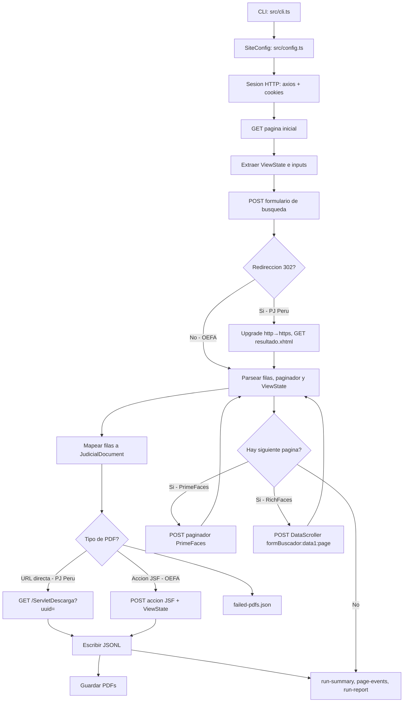
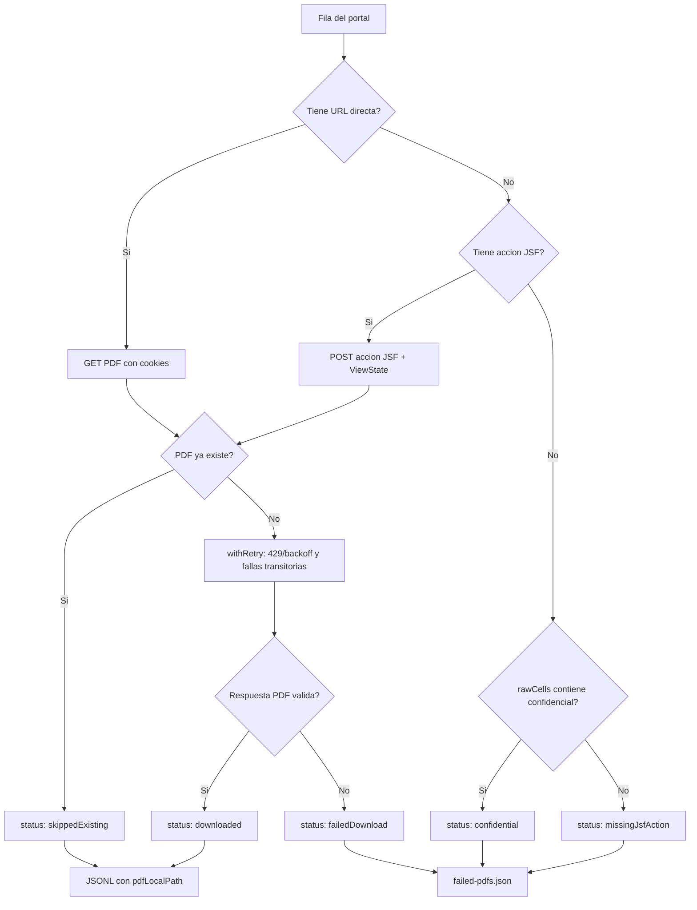
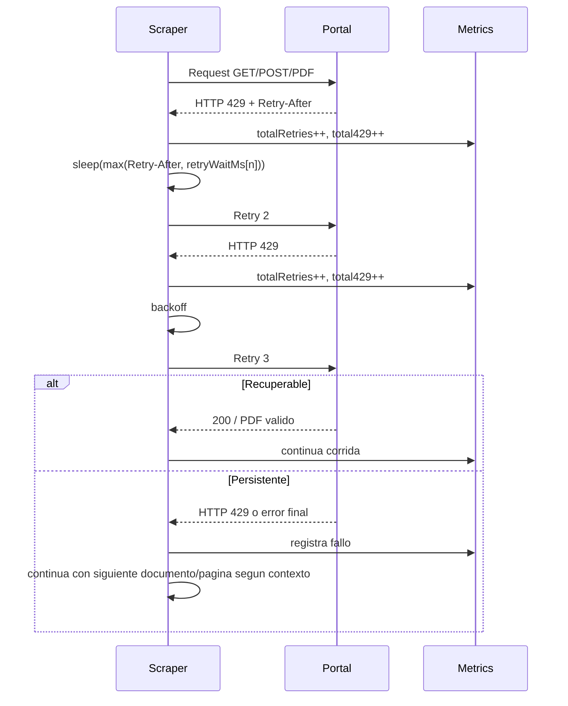
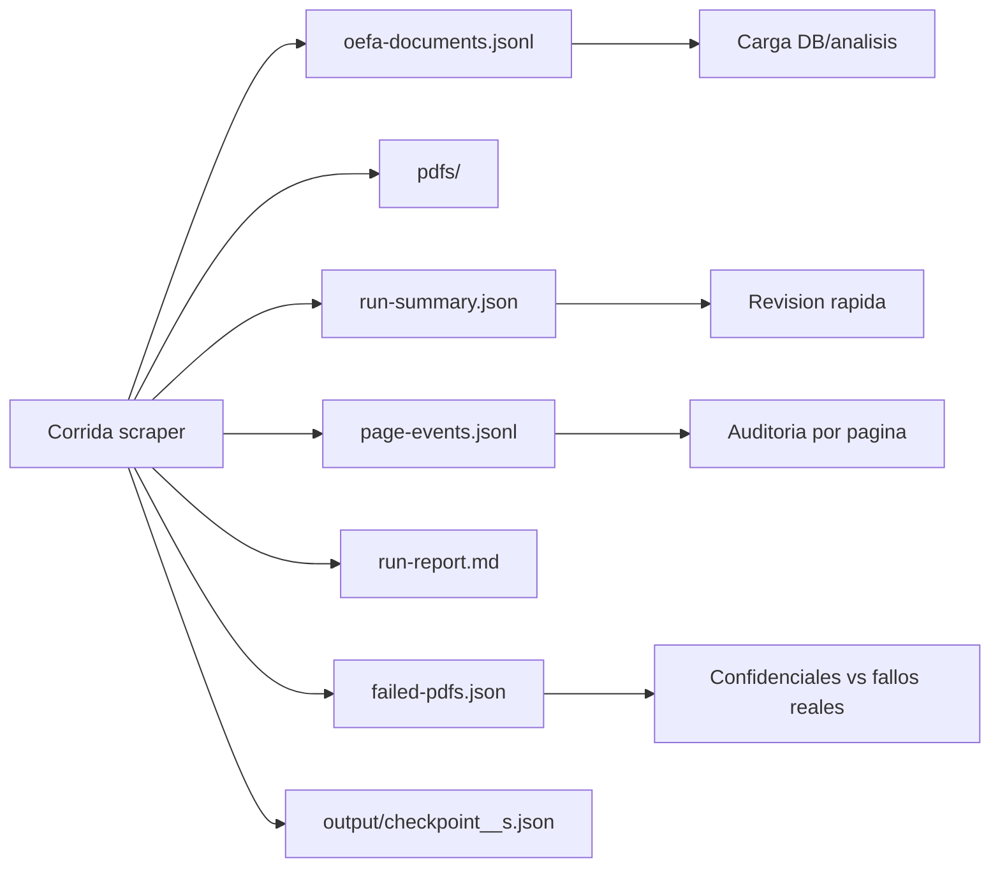

# pj-peru-scraper

Scraper HTTP en TypeScript para portales JSF peruanos, sin automatizacion de navegador. Soporta dos variantes: OEFA (PrimeFaces) y PJ Peru (RichFaces). Ambos sitios validados con extraccion real y descarga de PDFs.

## Resumen Ejecutivo

El desafio pide extraer documentos, navegar paginas, descargar PDFs y manejar rate limiting HTTP 429. El scraper cubre dos portales con tecnologias JSF distintas — el mismo nucleo de sesion, ViewState y retry/backoff funciona en ambos.

| Requisito | Estado | Evidencia |
| --- | --- | --- |
| TypeScript | Cumplido | `src/**/*.ts`, `npm run build` |
| Sin browser automation | Cumplido | `axios` + `cheerio`; no Puppeteer/Playwright/Selenium |
| Navegacion/paginacion | Cumplido — OEFA y PJ Peru | PrimeFaces (OEFA) y RichFaces DataScroller (PJ Peru) |
| Extraccion de datos | Cumplido — ambos sitios | JSONL con campos normalizados y `rawCells` |
| Descarga de PDFs | Cumplido — ambos sitios | OEFA: accion JSF POST · PJ Peru: GET `/ServletDescarga?uuid=` |
| PDFs no disponibles | Cumplido | `confidential` separado de `failedDownload` |
| Manejo 429 con backoff | Cumplido | `npm run simulate:429` valida 429 recuperable y persistente |
| Registro de fallos reintentables | Cumplido | `failed-pdfs.json` |
| OEFA — sitio alternativo | Validado (1,724 docs, 5 sectores, 0 HTTP 429) | `output/mineria/`, `output/hidrocarburos/`, etc. |
| PJ Peru — sitio principal | Validado con VPN Peru (100 docs, 10 paginas, 100 PDFs ok) | `output/pjperu/pj-peru-100.jsonl` |

## Quick Start

```bash
npm install
npm run build
```

Corrida controlada OEFA (100 docs + PDFs):

```bash
npm run scrape:oefa:test100
```

Corrida PJ Peru (requiere VPN/proxy peruano):

```bash
node dist/cli.js --site pj-peru --limit 10 --pdfs \
  --pdf-dir output/pjperu/pdfs \
  --out output/pjperu/pj-peru-documents.jsonl
```

Todos los sectores OEFA en paralelo:

```bash
npm run scrape:oefa:parallel
```

Simulacion reproducible de rate limiting:

```bash
npm run simulate:429
```

## Scripts Principales

| Script | Uso |
| --- | --- |
| `npm run build` | Compila TypeScript |
| `npm run scrape:oefa:test100` | Corrida controlada de 100 documentos OEFA + PDFs |
| `npm run scrape:oefa:mineria` | Sector MINERIA desde cero |
| `npm run scrape:oefa:mineria:resume` | Retoma MINERIA desde checkpoint |
| `npm run scrape:oefa:parallel` | Los 5 sectores OEFA en paralelo (~3 min total vs ~12 min secuencial) |
| `npm run scrape:oefa:parallel:dry` | Dry-run paralelo para validar sin escribir datos |
| `npm run simulate:429` | Prueba local de backoff 429, sin depender del servidor real |
| `npm run probe:oefa:429` | Probe agresivo contra OEFA real para observar si emite 429 |

## Arquitectura

El scraper no controla un navegador. Mantiene una sesion HTTP, conserva cookies, extrae `ViewState`, envia formularios JSF y parsea HTML con Cheerio. Soporta dos variantes de componentes JSF sin cambiar el nucleo.



Modulos clave:

| Modulo | Responsabilidad |
| --- | --- |
| `src/cli.ts` | Flags, `--fresh-output`, arranque |
| `src/config.ts` | Configuracion por sitio: URL, selectores, columnas, tiempos, `rowParser` |
| `src/session/*` | Axios, cookies, deteccion de rate limit, retry/backoff |
| `src/jsf/*` | Formularios, paginacion PrimeFaces y RichFaces, respuestas parciales JSF |
| `src/parser/*` | HTML a pagina, filas `<tr>` o div-repeat, documentos |
| `src/scraper/*` | Orquestacion por sitio/sector/pagina; multi-proceso paralelo |
| `src/pdf/downloader.ts` | Descarga directa (PJ Peru) y por accion JSF (OEFA) |
| `src/output/runReport.ts` | Artefactos de auditoria |
| `scripts/parallel-sectors.mjs` | Lanza N procesos Node en paralelo, uno por sector |
| `src/tools/simulate429.ts` | Validacion local de 429 |

## Flujo De PDFs

OEFA tiene documentos descargables y documentos confidenciales. Los confidenciales son documentos validos, pero el portal no expone PDF. El scraper los marca aparte para que no parezcan errores.



Interpretacion de estados:

| Estado | Significado | Accion |
| --- | --- | --- |
| `downloaded` | PDF descargado en esta corrida | OK |
| `skippedExisting` | PDF ya estaba en disco | OK en resume/retry |
| `confidential` | OEFA no expone PDF por confidencialidad | Esperado, no es error |
| `missingJsfAction` | No se encontro URL ni accion JSF | Revisar selector si aumenta |
| `missingPdfUrl` | Documento sin URL directa | Normal en algunos sitios, depende del mapper |
| `failedDownload` | Hubo intento real y fallo | Reintentar o revisar red/portal/parser |

## Manejo De HTTP 429

El requisito pide detectar 429, aplicar backoff, continuar si persiste y registrar documentos fallidos. El scraper usa `withRetry()` en navegacion, paginacion y descarga de PDFs.



La prueba local no depende de que OEFA emita 429 en vivo:

```bash
npm run simulate:429
```

Salida esperada resumida:

```json
{
  "ok": true,
  "recoverable": {
    "attempts": 3,
    "retries": 2,
    "total429": 2,
    "outcome": "ok"
  },
  "persistent": {
    "attempts": 3,
    "retries": 3,
    "total429": 3,
    "outcome": "failed-after-retries"
  }
}
```

Esto demuestra dos escenarios del desafio:

| Escenario | Comportamiento validado |
| --- | --- |
| 429 recuperable | Espera, reintenta y sigue |
| 429 persistente | Agota intentos, registra metricas y falla controladamente |

Tambien existe un probe contra OEFA real:

```bash
npm run probe:oefa:429
```

Ese probe sirve para observar si el portal real empieza a limitar, pero no es necesario para demostrar la logica porque el servidor puede no emitir 429 durante una corrida normal.

## Artefactos De Corrida

Cada corrida no `dry-run` escribe evidencia junto al JSONL de salida.



| Archivo | Proposito |
| --- | --- |
| `oefa-documents.jsonl` | Un documento por linea, amigable para cargas incrementales |
| `pdfs/*.pdf` | PDFs descargados |
| `run-summary.json` | Totales, metricas y rutas de artefactos |
| `page-events.jsonl` | Evento estructurado por pagina |
| `run-report.md` | Resumen humano de la corrida |
| `failed-pdfs.json` | Inventario de confidenciales, missing y fallos reales |
| `checkpoint_*.json` | Estado para `--resume` |

## Evidencia Local Observada

Resultados reales de corridas en el workspace. Para entrega formal, regenerar con `--fresh-output`.

### OEFA — Sitio alternativo (PrimeFaces/JSF, sin VPN)

| Sector | Docs | PDFs ok | Confidenciales | Fallos reales | HTTP 429 | Duracion |
| --- | ---: | ---: | ---: | ---: | ---: | --- |
| MINERIA (1) | 840 | 786 | 44 | 10 | 0 | 3m0s |
| HIDROCARBUROS (3) | 434 | 397 | 33 | 4 | 0 | 4m11s |
| PESQUERIA (8) | 255 | 233 | 16 | 6 | 0 | 2m13s |
| ELECTRICIDAD (2) | 125 | 100 | 25 | 0 | 0 | 2m0s |
| INDUSTRIA (9) | 90 | 79 | 11 | 0 | 0 | 40s |
| **Total OEFA** | **1,744** | | | | **0** | |

Con `scrape:oefa:parallel`: todos los sectores en paralelo, tiempo total = sector mas lento (~3 min).

### PJ Peru — Sitio principal (RichFaces/JSF, requiere VPN Peru)

| Corrida | Docs | PDFs ok | Fallos | HTTP 429 | Duracion |
| --- | ---: | ---: | ---: | ---: | --- |
| Prueba inicial (5 docs) | 5 | 5 | 0 | 0 | 35s |
| Corrida validacion (100 docs, 10 paginas) | 100 | 100 | 0 | 0 | ~7m |
| Test distritos v1 — 20 workers, pdf-concurrency 20 | 1,350 | 50 | 7 distritos (79%)* | 0 | ~3.5m |
| Test distritos v2 — 20 workers, pdf-concurrency 5 | ~1,700 | ~425 | objetivo &lt;5% | 0 | ~5m |

> *Root cause analizado: PDF concurrency 20 × 20 workers = 400 conexiones simultáneas a `/ServletDescarga` → saturacion. Solución: pdf-concurrency 5 por worker (100 totales). Startup jitter elimino los fallos de busqueda inicial (34/34 OK en dry-run).

**Escala real del dataset (medida en vivo):**

| Corte | Docs totales | Paginas (10/pag) | Con PDFs (20 conc.) | Sin PDFs | Con paralelismo distrital |
| --- | ---: | ---: | --- | --- | --- |
| Suprema (buCorte=1) | 207,527 | 20,753 | ~17h | ~4h | — (1 corte nacional) |
| Superior — sin paralelismo | ~458,909 | ~45,891 | ~76h | ~18h | — |
| Superior — 34 distritos x 20 workers | ~458,909 | ~45,891 | ~8h | ~2h | 34x speedup |
| **Ambas estrategias combinadas** | **~666,436** | **~66,644** | **~17h** | **~4h** | max(Suprema, Superior) |

Estimacion de speedup: 34 distritos con 20 workers = 2 rondas de ~90min c/u. El bottleneck pasa a ser Suprema (~4h JSONL only).

- PDFs via GET directo: `/jurisprudenciaweb/ServletDescarga?uuid=...` (298–453 KB por PDF)
- 0 HTTP 429 observados en ninguna corrida; el servidor usa saturacion silenciosa (empty AJAX / HTTP 500), no 429.
- Checkpoints por distrito: `output/checkpoint_pj-peru_s2_d18.json` — reanudar con `--resume`.

Notas generales:

- `Confidenciales` en OEFA no son fallas del scraper; OEFA no expone esos PDFs.
- `Fallos reales` quedan en `failed-pdfs.json` como `failedDownload` y son reintentables.
- 0 HTTP 429 reales en ambos sitios; `simulate:429` provee evidencia deterministica del comportamiento.

## Opciones Del CLI

| Opcion | Uso |
| --- | --- |
| `--site oefa` | Portal OEFA (PrimeFaces, sin VPN) |
| `--site pj-peru` | Portal PJ Peru (RichFaces, requiere VPN Peru) |
| `--sector 1` | OEFA: `1=MINERIA`, `2=ELECTRICIDAD`, `3=HIDROCARBUROS`, `8=PESQUERIA`, `9=INDUSTRIA`. PJ Peru: `1=SUPREMA`, `2=SUPERIOR` |
| `--district 18` | PJ Peru solamente: filtra por distrito judicial (ej. `18=Lima`). Usado por `parallel-districts.mjs`. |
| `--discover-sectors` | Lee sectores desde el portal y termina |
| `--limit 100` | Limita documentos (util para pruebas de menos de 10 min) |
| `--pdfs` | Activa descarga de PDFs |
| `--pdf-dir <dir>` | Directorio de PDFs |
| `--pdf-concurrency 20` | Maximo de descargas PDF concurrentes por pagina |
| `--fresh-output` | Limpia JSONL y `failed-pdfs.json` del destino antes de correr |
| `--resume` | Retoma desde checkpoint por sitio/sector/distrito |
| `--dry-run` | Recorre y loguea sin escribir salida |
| `--proxy <url>` | Proxy HTTP/HTTPS para PJ Peru o redes restringidas |

## Checkpoints Y Resume

Los checkpoints viven en `output/checkpoint_{site}_s{sectorId}.json`.

Con `--resume`, el scraper:

1. Carga el checkpoint del sector.
2. Abre una sesion nueva.
3. Reenvia la busqueda.
4. Reproduce POSTs de paginacion hasta la pagina guardada.
5. Continua desde ahi.
6. Marca `completed: true` solo al terminar el sector.

Para auditoria limpia, usar `--fresh-output`. Para continuidad operacional, usar `--resume`.

## Paralelizacion Por Distrito — Por Que Y Como

### El problema: un solo proceso para 459k documentos es demasiado lento

La Corte Superior tiene ~459,000 documentos distribuidos en 34 distritos judiciales (Lima, Arequipa, Cusco, etc.). Si se consultan todos juntos (`buDistrito=0`, "Todos"), el scraper los navega en serie: pagina 1, pagina 2, ... pagina 45,891. Con el portal respondiendo a ~4-5 segundos por pagina, eso son **~51 horas** de corrida continua.

### La solucion: un proceso por distrito

Cada distrito tiene ~13,500 documentos en promedio. Si lanzamos 20 procesos en paralelo, cada uno filtrando un distrito diferente, el tiempo se reduce a **2 rondas de ~90 minutos = ~3 horas** para toda la Corte Superior.

```
Sin paralelismo:  1 proceso × 45,891 pages × 5s = 51h
Con paralelismo: 34 distritos ÷ 20 workers × 1,350 pages × 5s ≈ 3h
```

### Root cause: saturacion del pool de sesiones JSF

En el test inicial con 20 workers sin jitter, 7 de 34 distritos fallaron (79% de exito). Los errores no eran HTTP 429 — eran respuestas AJAX vacias (`Partial AJAX response empty`). Esto es saturacion silenciosa del servidor, no rate limiting formal.

**Por que ocurre:** El servidor JSF/RichFaces mantiene un pool de sesiones y ViewStates activos en memoria. Cuando 20 procesos arrancan exactamente al mismo tiempo y todos hacen GET + POST de busqueda en el mismo segundo, el pool se satura y algunos requests reciben respuestas vacias en lugar de un error explicito.

**Las 3 mejoras implementadas:**

| Mejora | Donde | Efecto |
| --- | --- | --- |
| **Startup jitter** | `parallel-districts.mjs` | Cada worker espera `slotIdx × 600ms + random(800ms)` antes de arrancar. Los 20 workers se distribuyen en ~14 segundos en lugar de arrancar todos a la vez. Elimina la saturacion inicial. |
| **Full jitter en retries** | `src/session/retry.ts` | Los reintentos usan `base/2 + random(base/2)` en lugar de tiempos fijos. Evita que todos los workers fallidos reintenten al mismo segundo, lo que volveria a saturar el servidor. |
| **`setMaxListeners(0)`** | `parallel-districts.mjs` | Suprime el warning de Node.js sobre event listeners al tener 20+ streams activos. No afecta funcionalidad, solo limpieza de logs. |

### Comandos de paralelismo distrital

```bash
# Validacion rapida — 34 distritos x 5 docs, sin PDFs (~2 min)
npm run scrape:pjperu:districts:dry

# Test de 10 minutos — 34 distritos x 50 docs, con PDFs (~3-5 min)
npm run scrape:pjperu:districts:test

# Corrida completa — Superior completo con PDFs (~3h con VPN)
npm run scrape:pjperu:districts

# Reanudar si se interrumpe
npm run scrape:pjperu:districts:resume
```

Los archivos de salida se generan por distrito y luego se fusionan automaticamente:
```
output/pjperu-districts/
  district-18-LIMA.jsonl       # docs del Distrito Lima
  district-4-AREQUIPA.jsonl    # docs de Arequipa
  ...
  all-districts.jsonl          # fusion de todos los OK
  pdfs/                        # PDFs descargados
```

## Estrategia De Extraccion Masiva PJ Peru

El dataset completo (~666k docs) no requiere descargarse de una sola vez. La estrategia optima:

### Opcion A — Distritos paralelos (recomendada, ~4h total)

```bash
# Suprema en un proceso + Superior en 34 distritos paralelos
node dist/cli.js --site pj-peru --sector 1 --out output/pjperu-suprema.jsonl &
npm run scrape:pjperu:districts
# El bottleneck es Suprema (~4h sin PDFs). Superior termina en ~2h.
```

### Opcion B — Solo metadatos primero, PDFs despues

```bash
# Fase 1: JSONL sin PDFs (mucho mas rapido)
npm run scrape:pjperu:districts  # sin --pdfs en package.json, editar si se prefiere

# Fase 2 (pendiente implementar): leer JSONL y descargar PDFs sin re-navegar el portal
# node scripts/pdf-only.mjs --input output/pjperu-districts/all-districts.jsonl --concurrency 50
```

### Tabla de escenarios (referencia)

| Escenario | Docs | Tiempo estimado |
| --- | ---: | --- |
| Dry-run validacion | 5/distrito = 170 | ~1 min |
| Test 10 min (50/distrito) | 1,700 | ~3-5 min |
| Superior completo con distritos | ~459,000 | ~3h |
| Suprema completa (1 proceso) | ~207,000 | ~4h |
| Todo PJ Peru con paralelismo | ~666,000 | ~4h (paralelo) |

## PJ Peru — Diferencias Tecnicas Respecto A OEFA

PJ Peru usa **RichFaces 4.2.2 + Mojarra** (no PrimeFaces). Las diferencias relevantes:

| Aspecto | OEFA | PJ Peru |
| --- | --- | --- |
| Componente UI | PrimeFaces DataTable | RichFaces DataScroller + Repeat |
| Resultado | `<tr data-ri="N">` | `<div id="formBuscador:repeat:N:j_idt455">` |
| Paginacion AJAX | `_pagination=true` + `_first=N` | `formBuscador:data1:page=N` |
| Post-busqueda | POST directo | POST `inicio.xhtml` → 302 → GET `resultado.xhtml` |
| Redireccion | No | Si; servidor emite `http://` aunque se accede por `https://` — el scraper hace el upgrade manual |
| PDFs | POST accion JSF + ViewState | GET `/ServletDescarga?uuid=...` |
| VPN requerida | No | Si (IP peruana) |

Configuracion validada en `src/config.ts` bajo la clave `pj-peru`. Para correr:

```bash
# Con VPN peru activa:
node dist/cli.js --site pj-peru --limit 10 --dry-run
node dist/cli.js --site pj-peru --limit 100 --pdfs --pdf-dir output/pjperu/pdfs --out output/pjperu/pj-peru-documents.jsonl
```

## Checklist De Entrega

1. `npm run build` — sin errores TypeScript.
2. `npm run simulate:429` — confirmar que salida muestra `"ok": true`.
3. `npm run scrape:oefa:test100` — corrida OEFA limpia de 100 docs.
4. `node dist/cli.js --site pj-peru --dry-run --limit 20` (con VPN peru) — confirmar 2+ paginas.
5. `npm run scrape:pjperu:districts:dry` (con VPN peru) — confirmar 34/34 distritos OK.
6. Revisar `run-summary.json` y `failed-pdfs.json`.
7. Confirmar que `confidential` no aparece como `failedDownload`.
8. Compartir rama `feat/pj-peru-full-extraction` o `main` con artefactos documentados.

## Guia Para Un Futuro Colega

Si solo puedes leer tres cosas:

1. Este README.
2. `src/scraper/sectorScraper.ts` para entender el loop por pagina.
3. `src/pdf/downloader.ts` y `src/session/retry.ts` para entender PDFs, 429 y backoff.

Si revisas datos:

- Empieza por `run-summary.json`.
- Usa `page-events.jsonl` para reconstruir la corrida.
- Trata `failed-pdfs.json` como inventario, no como lista pura de errores.
- Separa siempre `confidential` de `failedDownload`.

## Licencia

MIT.
