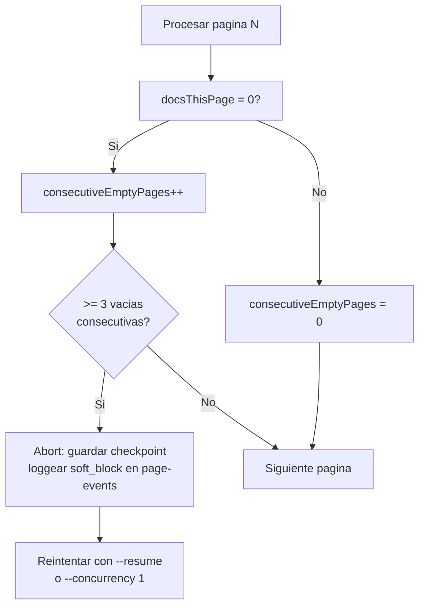

# JSF / Portal Error Log

Errores y comportamientos anomalos observados en produccion durante ejecuciones reales de 2026-06-27.

## Errores de sesion JSF (los mas frecuentes)

| Sintoma observado | Causa root | Donde ocurrio | Accion correctiva verificada |
| --- | --- | --- | --- |
| `Partial AJAX response empty` | Saturacion del pool JSF: 12 workers arrancando en `slotIdx × 600ms` en el mismo segundo satura el ViewState pool del servidor. Retorna HTML vacio, sin error HTTP. | Primer batch de 12 workers — 6 distritos afectados (AYACUCHO=80 docs, CALLAO=80, LIMA\_NORTE=90, CANETE=170, AMAZONAS=210, HUANUCO=200) | Reintentar ese distrito **solo** con `--concurrency 1`. Un proceso sin competencia completa correctamente. Confirmado en retry manual. |
| POST busqueda retorna 0 resultados pese a busqueda correcta | El servidor acepta el POST pero retorna una pagina sin filas. Ocurre cuando la VPN es detectada como trafico no peruano por el servidor de aplicaciones (diferente del CDN). | Primer intento sin VPN activa y en warm-up de sesion | Verificar VPN con `--dry-run --limit 5` antes de lanzar la ejecución principal. |
| Worker termina en pagina 1 sin avanzar | ViewState de la pagina de resultados no coincide con la sesion que inicio la busqueda — el redirect de `inicio.xhtml → resultado.xhtml` genero un ViewState nuevo que no fue capturado correctamente | Primeras versiones del parser; resuelto con el fix del redirect `http→https` en `src/jsf/searchForm.ts` | Ya resuelto. Si reaparece: verificar que `parsePage` capture el ViewState del HTML de `resultado.xhtml`, no del `inicio.xhtml`. |

## Errores de paginacion

| Sintoma observado | Causa root | Donde ocurrio | Accion correctiva verificada |
| --- | --- | --- | --- |
| `totalPages = ?` en terminal durante toda la ejecución | `parsePaginatorText` busca `"maxValue"` en los `<script>` tags — ese config solo esta en la respuesta HTML completa del `GET resultado.xhtml`. Las respuestas AJAX parciales (cada POST de paginacion) no lo incluyen. | Todas las ejecuciones hasta commit `6196239` | Fix aplicado: si `totalPages === null` y `totalRecords !== null`, se computa `totalPages = ceil(totalRecords / 10)`. Resuelto. |
| Paginas intermedias regresan menos de 10 docs | El selector de paneles `div.rf-p[id^="formBuscador:repeat:"]` fallo en parsear la respuesta AJAX — puede ocurrir si la respuesta parcial no incluye el marcado completo del repeat. | Ocasional, no sistematico | Soft-block detection lo captura como `soft_block_warning` en `page-events.jsonl`. Si es sistematico, revisar que la respuesta AJAX incluya `formBuscador:repeat` en el `render` de la request de paginacion. |
| DataScroller no avanza (misma pagina en loop) | El componente `formBuscador:data1` no recibio el numero de pagina correcto en el POST. El ID del componente puede cambiar entre builds del portal. | No observado en produccion actual | Verificar en DevTools que el campo `formBuscador:data1:page` coincida con la respuesta del paginator. El selector en `src/jsf/pagination.ts` usa el ID configurable. |

## Errores de selectores HTML

| Sintoma observado | Causa root | Donde ocurrio | Accion correctiva verificada |
| --- | --- | --- | --- |
| Todos los campos `null` (tipoRecurso, sumilla, etc.) pese a respuesta no vacia | El selector original `[id$=":j_idt455"]` era el ID de un panel especifico de esa sesion JSF. En cada nueva sesion, el servidor genera un sufijo diferente (`j_idt789`, etc.). | ejecución inicial — detectado en code review | Fix: cambiar a selector de clase CSS `div.rf-p` que es estable. Resuelto en commit `c6ea5dc`. |
| `palabrasClave` null en ~38% de documentos | Algunos paneles no incluyen el bloque "Palabras Clave" — es un campo opcional en el portal (no todos los casos lo tienen). | Coverage report: 62% de docs tienen palabrasClave | Comportamiento esperado. No es un bug del parser. |
| `sumilla` null en ~40% de documentos | Igual que palabrasClave — campo opcional. Algunos tipos de resolucion (autos, decretos) no generan sumilla. | Coverage report: 60% de docs tienen sumilla | Comportamiento esperado. |

## Comportamientos del portal entendidos (no bugs del scraper)

| Comportamiento | Explicacion | Impacto |
| --- | --- | --- |
| `ponente` y `dirimente` muestran `***` en la ficha | El portal oculta intencionalmente estos campos para documentos en ciertos estados procesales. No es un error del scraper ni un campo faltante. | Campos no disponibles via scraping. Omitir del schema. |
| Ficha modal no genera XHR | Los datos de "Ver Ficha" estan pre-renderizados en el HTML inicial dentro del mismo `div.rf-p` panel. El boton solo hace toggle CSS (RichFaces `rich:togglePanel` o similar). | Los campos de la ficha son parseables sin requests adicionales. Implementado en este commit. |
| Portal responde 0 resultados sin VPN | El endpoint de busqueda verifica la IP de origen. Sin VPN peruana, la busqueda devuelve pagina vacia sin mensaje de error. | Siempre verificar VPN antes de correr. |
| UUID de PDF expira | Los UUID en `/ServletDescarga?uuid=X` son temporales — generados por sesion. Un UUID capturado en una sesion anterior puede devolver 404 en otra sesion diferente. | Por eso el scraper descarga PDFs en la misma sesion que los scrapeó. En pdf-only.mjs habra que re-autenticar. |

## Soft Block — Deteccion Y Respuesta Automatica

El portal PJ Peru usa saturacion silenciosa en lugar de HTTP 429. Cuando un worker hace demasiadas requests, el servidor empieza a servir paginas con 0 documentos en vez de retornar un error explicito. Sin deteccion, el scraper navega decenas de paginas vacias y nunca termina.



Constante configurable en `src/scraper/sectorScraper.ts`:

```typescript
const CONSECUTIVE_EMPTY_ABORT = 3; // abortar si 3 paginas seguidas devuelven 0 docs
```

El evento de abort se registra en `page-events.jsonl` con `type: "soft_block_abort"` para auditoria.
