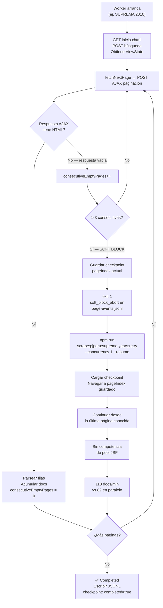

# Retry Policy — JSF Pool Saturation vs HTTP 429

## Flujo completo: detección → abort → retry



## El problema que este documento explica

El portal PJ Peru Suprema no emite HTTP 429 cuando se sobrecarga. En su lugar, el servidor JSF devuelve respuestas AJAX parciales vacías — el XML de respuesta llega con status 200 pero sin contenido HTML. Un scraper ingenuo lo trataría como "página vacía" y avanzaría, silenciosamente truncando la extracción.

## Mecanismo de detección

```typescript
// src/scraper/sectorScraper.ts
const CONSECUTIVE_EMPTY_ABORT = 3;

const reachedAbortThreshold = consecutiveEmptyPages >= CONSECUTIVE_EMPTY_ABORT;
```

Cuando tres páginas consecutivas devuelven AJAX vacío, el scraper:
1. Registra el evento como `soft_block_abort` en `page-events.jsonl`
2. Guarda un checkpoint con el último `pageIndex` procesado
3. Termina el worker con `exit 1` — distinguible de un crash real

El threshold de 3 es conservador: evita abortar por un parpadeo del servidor (1 página vacía) pero tampoco desperdicia requests en un pool que ya está saturado.

## Causa raíz: saturación del ViewState pool

El servidor JSF mantiene un pool de ViewState en sesión. Con 12 workers arrancando simultáneamente:

- Cada worker bootstrapea una sesión y solicita un ViewState slot
- Los slots disponibles se agotan a medida que los workers abren páginas en paralelo
- El servidor empieza a devolver respuestas AJAX vacías para workers que no tienen slot disponible
- Los workers que arrancaron más tarde (o que abren más páginas) son los primeros en caer

**Evidencia empírica del run 2026-06-27:**

| Modo | Año | Docs/min | Notas |
|------|-----|--------:|-------|
| Paralelo (12 workers) | 2010 | 82 | Compitiendo por ViewState slots |
| Retry (1 worker) | 2010 | **120** | Sin competencia — 46% más rápido |

El servidor no tiene un límite de velocidad real. El límite es de concurrencia de sesión.

## Estrategia de retry

```bash
# Retry de años que hicieron soft-block — concurrency 1 evita saturación
npm run scrape:pjperu:suprema:years:retry

# Equivalente explícito:
node scripts/parallel-suprema-years.mjs \
  --years 2010,2013,2015,2016,2017,2018,2021,2022,2024,2025 \
  --concurrency 1 \
  --resume
```

`--concurrency 1` ejecuta los años secuencialmente — un ViewState slot a la vez, sin competencia.  
`--resume` retoma desde el checkpoint guardado al abortar, sin reprocesar docs ya extraídos.

## Cuándo usar cada modo

| Comando | Concurrency | Cuándo usarlo |
|---------|-------------|---------------|
| `scrape:pjperu:suprema:years` | 12 | Primera extracción — maximiza throughput total |
| `scrape:pjperu:suprema:years:resume` | 12 | Retomar run interrumpido por red/VPN |
| `scrape:pjperu:suprema:years:retry` | 1 | Años que hicieron soft-block — elimina contención |
| `scrape:pjperu:suprema:years:dry` | 4 | Validar configuración sin datos reales |

## Resiliencia adicional: timeout retry

Durante el retry de 2010, la página 59 devolvió timeout (30s). El scraper tiene retry a nivel de request:

```typescript
// src/session/retry.ts
const MAX_RETRY_ATTEMPTS = 3;
// waits: jitter aleatorio sobre la base configurada en siteConfig.timing.retryWaitMs
```

El timeout se reintentó automáticamente (intento 1/3) y el worker continuó. No requirió intervención manual.

## Señales de soft-block vs crash real

| Señal | Soft-block | Crash real |
|-------|-----------|------------|
| Exit code | `exit 1` | `exit 1` o dump |
| Log | `WARN Partial AJAX response empty` × 3 | Stack trace / unhandled rejection |
| Checkpoint | Guardado | Guardado hasta el último flush |
| `page-events.jsonl` | `soft_block_abort` event | `error` event |
| Acción | `--resume --concurrency 1` | Investigar error antes de retry |
